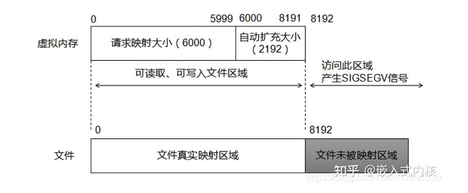
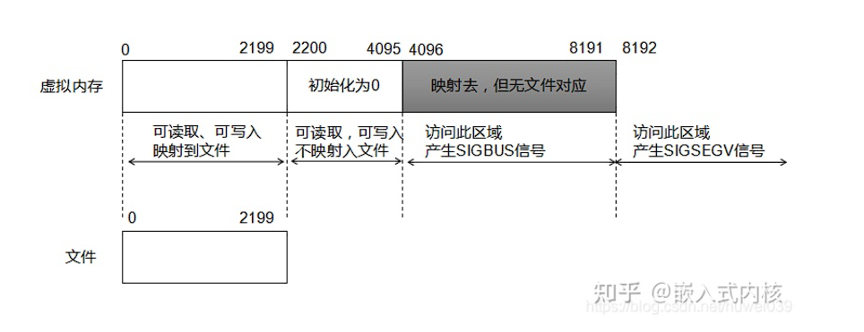

## 进程间通信（IPC）

### 基本概念


### 管道

管道是一种最基本的IPC机制，作用于有血缘关系的进程之间，完成数据传递。调用pipe系统函数即可创建一个管道。有如下特质：

* 其本质是一个伪文件(实为内核缓冲区) 

* 由两个文件描述符引用，一个表示读端，一个表示写端。

* 规定数据从管道的写端流入管道，从读端流出。

管道的原理：管道实为内核使用环形队列机制，借助内核缓冲区(4k)实现。

管道的局限性：

* 数据不能进程自己写，自己读。

* 管道中数据不可反复读取。一旦读走，管道中不再存在。 

* 采用半双工通信方式，数据只能在单方向上流动。
* 只能在有公共祖先的进程间使用管道。


### pipe

```c
   #include <unistd.h>

   int pipe(int pipefd[2]);
```

创建并打开一个管道（匿名管道），pipefd是一个大小为2的数组，若调用成功，pipefd数组的的两个元素会被赋值为：**pipefd[0]是管道读端的文件描述符，pipefd[1]是管道写端的文件描述符**，并返回0，若异常错误则返回-1

在fork函数中提到，父进程和子进程之间的文件描述符表是共享的，因此可以根据这个机制来实现IPC，原理图如下：


这也就是意味着如果通过管道来实现IPC，**两个进程必须有公共祖先（包括：一个是另一个的祖先）**，下面是一个使用pipe的demo：

```c
       int main(int argc, char *argv[]) {
           int pipefd[2];
           pid_t cpid;
           char buf;

           if (argc != 2) {
               fprintf(stderr, "Usage: %s <string>\n", argv[0]);
               exit(EXIT_FAILURE);
           }

           if (pipe(pipefd) == -1) {
               perror("pipe");
               exit(EXIT_FAILURE);
           }

           cpid = fork();
           if (cpid == -1) {
               perror("fork");
               exit(EXIT_FAILURE);
           }

           if (cpid == 0) {    /* Child reads from pipe */
               close(pipefd[1]);          /* Close unused write end */

               while (read(pipefd[0], &buf, 1) > 0)
                   write(STDOUT_FILENO, &buf, 1);

               write(STDOUT_FILENO, "\n", 1);
               close(pipefd[0]);
               _exit(EXIT_SUCCESS);

           } else {            /* Parent writes argv[1] to pipe */
               close(pipefd[0]);          /* Close unused read end */
               write(pipefd[1], argv[1], strlen(argv[1]));
               close(pipefd[1]);          /* Reader will see EOF */
               wait(NULL);                /* Wait for child */
               exit(EXIT_SUCCESS);
           }
       }
```

##### 需要注意

* 从管道中读时：
  * 若管道有数据，read返回实际读到的字节数
  * 若管道无数据：
    * 若管道写端引用计数为0（没有进程向该管道写），read返回0
    * 若管道写端引用计数大于0（有进程向该管道写），read会发生阻塞，直到管道中被写入数据

* 向管道中写时：
  * 若管道读端引用计数为0（没有进程从该管道读），写管道的进程会接收到内核发出的SIGPIPE信号并异常终止
  * 若管道读端引用计数大于0（有进程从该管道读）：
    * 若管道数据未满，write返回实际写入的字节数
    * 若管道数据已满，write会发生阻塞，直到管道中被读出数据


### 命名管道

FIFO常被称为命名管道，以区分管道(pipe)。管道(pipe)只能用于“有血缘关系”的进程间。但通过FIFO，不相关的进程也能交换数据。FIFO是Linux基础文件类型中的一种。但，**FIFO文件在磁盘上没有数据块，仅仅用来标识内核中一条通道**。各进程可以打开这个文件进行读写IO，实际上是在读写内核通道，这样就实现了进程间通信。

可以通过命令mkfifo或者库函数mkfifo创建命名管道


### mkfifo

```c
   #include <sys/types.h>
   #include <sys/stat.h>

   int mkfifo(const char *pathname, mode_t mode);
```

创建一个命名管道，参数以及返回值的含义和creat函数基本相同

使用命名管道进行IPC时，只需要将命名管道当成普通文件操作，一个进程向fifo中写，同时另一个进程向fifo中读即可，这两个进程只要打开的是同一个fifo文件就可以实现IPC，虽然两个进程对应fifo的文件描述符fd不一定相同，指向的file_struct不同，但是指向的内核缓冲区是同一块，这个思路和通过普通文件实现IPC的原理是相同的，均不需要两个进程之间存在公共祖先


### mmap

```c
   #include <sys/mman.h>

   void *mmap(void *addr, size_t length, int prot, int flags,
              int fd, off_t offset);
   int munmap(void *addr, size_t length);
```

mmap将磁盘文件中的内容映射到内存的指定区域中，这样可以通过内存地址操作内存，从而来操作文件，同样，若多个进程对同一个文件进行内存映射，这样就可以通过这块内存实现IPC，而这一块内存又称为共享内存

mmap的原型包括参数如下：

* addr：指定内存映射区的首地址，通常传NULL，这样内核会自动分配内存映射区的首地址
* length：指定内存映射区的大小，**若不为4k的倍数，系统会自动向上取整，创建4k的倍数大小的内存映射区**
* prot：指定内存映射区的读写属性，包括四个宏：PROT_READ、PROT_WRITE、PROT_EXEC、PROT_NONE，分别表示：可读、可写、可执行、无权限，通过位操作来使用这些宏（基本上只用得上读和写）
* flags：指定内存映射区的共享属性主要包括两个宏：MAP_SHARED、MAP_PRIVATE，分别表示：共享映射（内存映射区的内容修改会更新到磁盘）、私有映射（内存映射区的内容修改不会更新到磁盘），一个可以用于修改文件，实现IPC，而另一个只能用于通过文件内容来初始化内存区域
* fd：指定用于创建内存映射区的文件的文件描述符
* offset：指定映射文件的起始偏移位置，必须是4k的整数倍（Linux文件系统操作磁盘文件的单位是4k）

调用成功，返回内存映射区的首地址，**若异常错误，返回MAP_FAILED，值为(void *)-1**

munmap用于释放内存映射区，其中参数addr指定内存映射区的首地址（mmap的返回值），参数length指定内存映射区的长度，释放成功返回0，异常错误返回-1

##### 需要注意

* mmap映射的被打开的文件**必须设置可读权限**（即O_RDONLY或O_RDWR），因为mmap映射需要读文件，否则mmap映射会报Permission denied

* 若内存映射区的读写权限应该大于被映射的打开的文件的读写权限，除非flags为MAP_PRIVATE，否则mmap映射会报Permission denied

* 访问内存映射区时（下面提到的文件大小是指有效文件大小，即文件末尾偏移量 - offset）：

  * 若内存映射区比文件大小小（length参数为6000，文件大小为9500），内存映射区会扩充到8192

    

  * 若内存映射区比文件大小大（length参数为6000，文件大小为2200），内存映射区会扩充到8192，其中可以读取的区域大小是文件大小按4k向上取整的

    

* 创建一个超过文件大小的映射可能是无意义的，可以通过 ftruncate() 或 write()去扩充文件大小，然后再映射，使映射变得有意义

* 若mmap的length参数为0，mmap映射会报Invalid argument

* 若mmap的offset参数不为4k的倍数，mmap映射会报Invalid argument

* 若内存映射区设置了只读权限（没有PROT_WRITE属性），后续对内存映射区进行了内存修改操作，内核会发出SIGSEGV信号

* 完成内存映射后关闭文件是没有问题的，后续可以正常访问内存映射区，同时可以更新文件内容

* 若munmap的addr参数不是mmap的返回值，munmap会报Invalid argument

* **若offset的大小大于文件大小按4k向上取整，内核会抛出SIGBUG信号**

* 一定要检查mmap的返回值，mmap非常容易出错

* **建议mmap使用参数如下：**

  * **open函数中flags的参数包括O_RDWR**
  * **mmap函数中addr的参数为NULL，length为4k的倍数，值等于文件大小按4k向上取整**
  * **mmap函数中prot的参数为PROT_READ | PROT_WRITE**
  * **mmap函数中flags的参数为MAP_SHARED**
  * **mmap函数中fd的参数有效**
  * **mmap函数中offset为4k的倍数，构成的内存映射区不要出现总线错误报错区域（不要太大），没有特殊需求就写0**


### mmap实现原理

https://blog.csdn.net/weixin_43743711/article/details/106723529


### mmap实现父子进程的IPC？

需要注意，mmap实现的本质，是在物理内存中选择特定的页框，将其和磁盘中的磁盘形成映射关系，然后MMU将这些页框的物理地址和用户逻辑空间的逻辑地址形成对应关系，不过一开始，这些物理页框都是属于缺页状态，一旦用户访问内存映射区，将触发缺页中断，MMU将对应磁盘块调入内存供其访问

若mmap设置了MAP_SHARED，则内存映射区对应的物理页框是唯一的，并一一对应文件的磁盘块，若fork创建子进程，这些物理页框不会有COW现象发生，这样父子进程均指向了相同的内存映射区，从而实现IPC

若mmap设置了MAP_PRIVATE，则内存映射区对应的物理页框不是唯一的，和文件的磁盘块也无关，若fork创建子进程，这些物理页框会有COW现象发生，导致父子进程指向的内存映射区是不同的，无法实现IPC

因此，实现父子进程的IPC需要设置MAP_SHARED，先mmap创建内存映射区，再fork创建子进程


### mmap实现非血缘进程的IPC

其代码实现和命名管道基本相同（基于文件载体实现），需要加MAP_SHARED属性，不过命名管道被读出后数据就清空了，


### mmap创建匿名映射区

**在flag中增加参数MAP_ANONYMOUS，将fd设置为-1，将offset设置为0**，可以实现匿名映射区，即不需要文件作为载体也可以创建内存映射区，此时内存映射区的大小可以不受文件大小限制，同时权限也不受打开文件权限限制，若再设置MAP_SHARED，可以实现IPC，不过注意，**由于没有文件作为载体，采用匿名映射时，非血缘进程无法实现IPC**

##### 需要注意

* 在部分UNIX系统中，不支持flags参数，此时可以打开UNIX系统的一种特殊文件/dev/zero，可以实现一样的效果，从/dev/zero中可以读到无穷的数据，都是\0，UNIX系统还有一种特殊文件/dev/null，可以将无穷的数据写到这个文件中，这两个文件本身是不存放数据的，只是在内核中有特殊的处理

* mmap不能通过打开/dev/zero或者/dev/null实现非血缘关系的IPC


### shmget

```c
   #include <sys/ipc.h>
   #include <sys/shm.h>

   int shmget(key_t key, size_t size, int shmflg);
```
