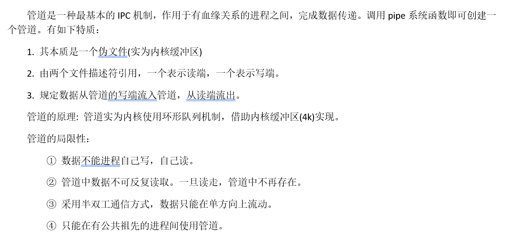

## 进程间通信（IPC）

### 基本概念


### 管道




### pipe

```c
   #include <unistd.h>

   int pipe(int pipefd[2]);
```

创建并打开一个管道（无名管道），pipefd是一个大小为2的数组，若调用成功，pipefd数组的的两个元素会被赋值为：**pipefd[0]是管道读端的文件描述符，pipefd[1]是管道写端的文件描述符**，并返回0，若异常错误则返回-1

在fork函数中提到，父进程和子进程之间的文件描述符表是共享的，因此可以根据这个机制来实现IPC，原理图如下：


这也就是意味着如果通过管道来实现IPC，**两个进程必须有公共祖先（包括：一个是另一个的祖先）**，下面是一个使用pipe的demo：

```c
       int main(int argc, char *argv[]) {
           int pipefd[2];
           pid_t cpid;
           char buf;

           if (argc != 2) {
               fprintf(stderr, "Usage: %s <string>\n", argv[0]);
               exit(EXIT_FAILURE);
           }

           if (pipe(pipefd) == -1) {
               perror("pipe");
               exit(EXIT_FAILURE);
           }

           cpid = fork();
           if (cpid == -1) {
               perror("fork");
               exit(EXIT_FAILURE);
           }

           if (cpid == 0) {    /* Child reads from pipe */
               close(pipefd[1]);          /* Close unused write end */

               while (read(pipefd[0], &buf, 1) > 0)
                   write(STDOUT_FILENO, &buf, 1);

               write(STDOUT_FILENO, "\n", 1);
               close(pipefd[0]);
               _exit(EXIT_SUCCESS);

           } else {            /* Parent writes argv[1] to pipe */
               close(pipefd[0]);          /* Close unused read end */
               write(pipefd[1], argv[1], strlen(argv[1]));
               close(pipefd[1]);          /* Reader will see EOF */
               wait(NULL);                /* Wait for child */
               exit(EXIT_SUCCESS);
           }
       }
```

##### 需要注意

* 从管道中读时：
  * 若管道有数据，read返回实际读到的字节数
  * 若管道无数据：
    * 若管道写端引用计数为0（没有进程向该管道写），read返回0
    * 若管道写端引用计数大于0（有进程向该管道写），read会发生阻塞，直到管道中被写入数据

* 向管道中写时：
  * 若管道读端引用计数为0（没有进程从该管道读），写管道的进程会接收到内核发出的SIGPIPE信号并异常终止
  * 若管道读端引用计数大于0（有进程从该管道读）：
    * 若管道数据未满，write返回实际写入的字节数
    * 若管道数据已满，write会发生阻塞，直到管道中被读出数据

