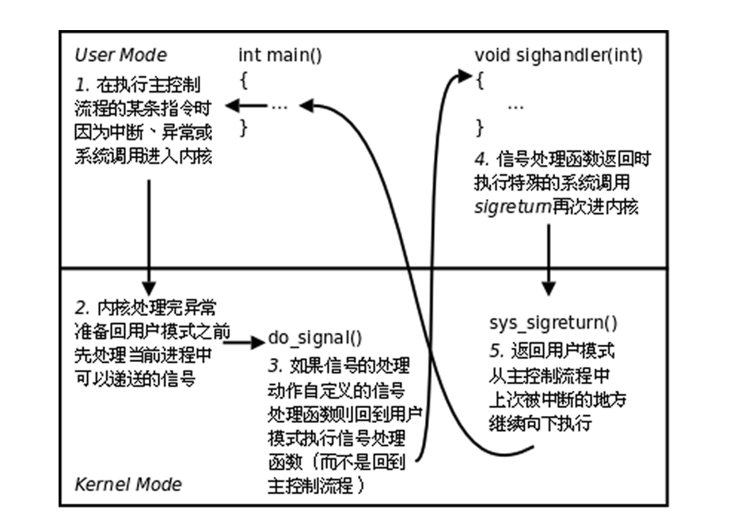

## 进程间通信（IPC）

### 基本概念


### 管道

管道是一种最基本的IPC机制，作用于有血缘关系的进程之间，完成数据传递。调用pipe系统函数即可创建一个管道。有如下特质：

* 其本质是一个伪文件(实为内核缓冲区) 

* 由两个文件描述符引用，一个表示读端，一个表示写端。

* 规定数据从管道的写端流入管道，从读端流出。

管道的原理：管道实为内核使用环形队列机制，借助内核缓冲区(4k)实现。

管道的局限性：

* 数据不能进程自己写，自己读。

* 管道中数据不可反复读取。一旦读走，管道中不再存在。 

* 采用半双工通信方式，数据只能在单方向上流动。
* 只能在有公共祖先的进程间使用管道。


### pipe

```c
   #include <unistd.h>

   int pipe(int pipefd[2]);
```

创建并打开一个管道（匿名管道），pipefd是一个大小为2的数组，若调用成功，pipefd数组的的两个元素会被赋值为：**pipefd[0]是管道读端的文件描述符，pipefd[1]是管道写端的文件描述符**，并返回0，若异常错误则返回-1

在fork函数中提到，父进程和子进程之间的文件描述符表是共享的，因此可以根据这个机制来实现IPC，原理图如下：


这也就是意味着如果通过管道来实现IPC，**两个进程必须有公共祖先（包括：一个是另一个的祖先）**，下面是一个使用pipe的demo：

```c
       int main(int argc, char *argv[]) {
           int pipefd[2];
           pid_t cpid;
           char buf;

           if (argc != 2) {
               fprintf(stderr, "Usage: %s <string>\n", argv[0]);
               exit(EXIT_FAILURE);
           }

           if (pipe(pipefd) == -1) {
               perror("pipe");
               exit(EXIT_FAILURE);
           }

           cpid = fork();
           if (cpid == -1) {
               perror("fork");
               exit(EXIT_FAILURE);
           }

           if (cpid == 0) {    /* Child reads from pipe */
               close(pipefd[1]);          /* Close unused write end */

               while (read(pipefd[0], &buf, 1) > 0)
                   write(STDOUT_FILENO, &buf, 1);

               write(STDOUT_FILENO, "\n", 1);
               close(pipefd[0]);
               _exit(EXIT_SUCCESS);

           } else {            /* Parent writes argv[1] to pipe */
               close(pipefd[0]);          /* Close unused read end */
               write(pipefd[1], argv[1], strlen(argv[1]));
               close(pipefd[1]);          /* Reader will see EOF */
               wait(NULL);                /* Wait for child */
               exit(EXIT_SUCCESS);
           }
       }
```

##### 需要注意

* 从管道中读时：
  * 若管道有数据，read返回实际读到的字节数
  * 若管道无数据：
    * 若管道写端引用计数为0（没有进程向该管道写），read返回0
    * 若管道写端引用计数大于0（有进程向该管道写），read会发生阻塞，直到管道中被写入数据

* 向管道中写时：
  * 若管道读端引用计数为0（没有进程从该管道读），写管道的进程会接收到内核发出的SIGPIPE信号并异常终止
  * 若管道读端引用计数大于0（有进程从该管道读）：
    * 若管道数据未满，write返回实际写入的字节数
    * 若管道数据已满，write会发生阻塞，直到管道中被读出数据


### 命名管道

FIFO常被称为命名管道，以区分管道(pipe)。管道(pipe)只能用于“有血缘关系”的进程间。但通过FIFO，不相关的进程也能交换数据。FIFO是Linux基础文件类型中的一种。但，**FIFO文件在磁盘上没有数据块，仅仅用来标识内核中一条通道**。各进程可以打开这个文件进行读写IO，实际上是在读写内核通道，这样就实现了进程间通信。

可以通过命令mkfifo或者库函数mkfifo创建命名管道


### mkfifo

```c
   #include <sys/types.h>
   #include <sys/stat.h>

   int mkfifo(const char *pathname, mode_t mode);
```

创建一个命名管道，参数以及返回值的含义和creat函数基本相同

使用命名管道进行IPC时，只需要将命名管道当成普通文件操作，一个进程向fifo中写，同时另一个进程向fifo中读即可，这两个进程只要打开的是同一个fifo文件就可以实现IPC，虽然两个进程对应fifo的文件描述符fd不一定相同，指向的file_struct不同，但是指向的内核缓冲区是同一块，这个思路和通过普通文件实现IPC的原理是相同的，均不需要两个进程之间存在公共祖先


### mmap

```c
   #include <sys/mman.h>

   void *mmap(void *addr, size_t length, int prot, int flags,
              int fd, off_t offset);
   int munmap(void *addr, size_t length);
```

mmap将磁盘文件中的内容映射到内存的指定区域中，这样可以通过内存地址操作内存，从而来操作文件，同样，若多个进程对同一个文件进行内存映射，这样就可以通过这块内存实现IPC，而这一块内存又称为共享内存

mmap的原型包括参数如下：

* addr：指定内存映射区的首地址，通常传NULL，这样内核会自动分配内存映射区的首地址
* length：指定内存映射区的大小，**若不为4k的倍数，系统会自动向上取整，创建4k的倍数大小的内存映射区**
* prot：指定内存映射区的读写属性，包括四个宏：PROT_READ、PROT_WRITE、PROT_EXEC、PROT_NONE，分别表示：可读、可写、可执行、无权限，通过位操作来使用这些宏（基本上只用得上读和写）
* flags：指定内存映射区的共享属性主要包括两个宏：MAP_SHARED、MAP_PRIVATE，分别表示：共享映射（内存映射区的内容修改会更新到磁盘）、私有映射（内存映射区的内容修改不会更新到磁盘），一个可以用于修改文件，实现IPC，而另一个只能用于通过文件内容来初始化内存区域
* fd：指定用于创建内存映射区的文件的文件描述符
* offset：指定映射文件的起始偏移位置，必须是4k的整数倍（Linux文件系统操作磁盘文件的单位是4k）

调用成功，返回内存映射区的首地址，**若异常错误，返回MAP_FAILED，值为(void *)-1**

munmap用于释放内存映射区，其中参数addr指定内存映射区的首地址（mmap的返回值），参数length指定内存映射区的长度，释放成功返回0，异常错误返回-1

##### 需要注意

* mmap映射的被打开的文件**必须设置可读权限**（即O_RDONLY或O_RDWR），因为mmap映射需要读文件，否则mmap映射会报Permission denied

* 若内存映射区的读写权限应该大于被映射的打开的文件的读写权限，除非flags为MAP_PRIVATE，否则mmap映射会报Permission denied

* 访问内存映射区时（下面提到的文件大小是指有效文件大小，即文件末尾偏移量 - offset）：

  * 若内存映射区比文件大小小（length参数为6000，文件大小为9500），内存映射区会扩充到8192

    

  * 若内存映射区比文件大小大（length参数为6000，文件大小为2200），内存映射区会扩充到8192，其中可以读取的区域大小是文件大小按4k向上取整的

    

* 创建一个超过文件大小的映射可能是无意义的，可以通过 ftruncate() 或 write()去扩充文件大小，然后再映射，使映射变得有意义

* 若mmap的length参数为0，mmap映射会报Invalid argument

* 若mmap的offset参数不为4k的倍数，mmap映射会报Invalid argument

* 若内存映射区设置了只读权限（没有PROT_WRITE属性），后续对内存映射区进行了内存修改操作，内核会发出SIGSEGV信号

* 完成内存映射后关闭文件是没有问题的，后续可以正常访问内存映射区，同时可以更新文件内容

* 若munmap的addr参数不是mmap的返回值，munmap会报Invalid argument

* **若offset的大小大于文件大小按4k向上取整，内核会抛出SIGBUG信号**

* 一定要检查mmap的返回值，mmap非常容易出错

* **建议mmap使用参数如下：**

  * **open函数中flags的参数包括O_RDWR**
  * **mmap函数中addr的参数为NULL，length为4k的倍数，值等于文件大小按4k向上取整**
  * **mmap函数中prot的参数为PROT_READ | PROT_WRITE**
  * **mmap函数中flags的参数为MAP_SHARED**
  * **mmap函数中fd的参数有效**
  * **mmap函数中offset为4k的倍数，构成的内存映射区不要出现总线错误报错区域（不要太大），没有特殊需求就写0**


### mmap实现原理

https://blog.csdn.net/weixin_43743711/article/details/106723529


### mmap实现父子进程的IPC？

需要注意，mmap实现的本质，是在物理内存中选择特定的页框，将其和磁盘中的磁盘形成映射关系，然后MMU将这些页框的物理地址和用户逻辑空间的逻辑地址形成对应关系，不过一开始，这些物理页框都是属于缺页状态，一旦用户访问内存映射区，将触发缺页中断，MMU将对应磁盘块调入内存供其访问

若mmap设置了MAP_SHARED，则内存映射区对应的物理页框是唯一的，并一一对应文件的磁盘块，若fork创建子进程，这些物理页框不会有COW现象发生，这样父子进程均指向了相同的内存映射区，从而实现IPC

若mmap设置了MAP_PRIVATE，则内存映射区对应的物理页框不是唯一的，和文件的磁盘块也无关，若fork创建子进程，这些物理页框会有COW现象发生，导致父子进程指向的内存映射区是不同的，无法实现IPC

因此，实现父子进程的IPC需要设置MAP_SHARED，先mmap创建内存映射区，再fork创建子进程


### mmap实现非血缘进程的IPC

其代码实现和命名管道基本相同（基于文件载体实现），需要加MAP_SHARED属性，不过命名管道被读出后数据就清空了，


### mmap创建匿名映射区

**在flag中增加参数MAP_ANONYMOUS，将fd设置为-1，将offset设置为0**，可以实现匿名映射区，即不需要文件作为载体也可以创建内存映射区，此时内存映射区的大小可以不受文件大小限制，同时权限也不受打开文件权限限制，若再设置MAP_SHARED，可以实现IPC，不过注意，**由于没有文件作为载体，采用匿名映射时，非血缘进程无法实现IPC**

##### 需要注意

* 在部分UNIX系统中，不支持flags参数，此时可以打开UNIX系统的一种特殊文件/dev/zero，可以实现一样的效果，从/dev/zero中可以读到无穷的数据，都是\0，UNIX系统还有一种特殊文件/dev/null，可以将无穷的数据写到这个文件中，这两个文件本身是不存放数据的，只是在内核中有特殊的处理

* mmap不能通过打开/dev/zero或者/dev/null实现非血缘关系的IPC


### shmget

```c
   #include <sys/ipc.h>
   #include <sys/shm.h>

   int shmget(key_t key, size_t size, int shmflg);
```


### 信号

信号在我们的生活中随处可见， 如：古代战争中摔杯为号；现代战争中的信号弹；体育比赛中使用的信号枪......

他们都有共性：**1. 简单 2. 不能携带大量信息 3. 满足某个特设条件才发送**

信号是信息的载体，Linux/UNIX 环境下，古老、经典的通信方式， 现下依然是主要的通信手段。Unix早期版本就提供了信号机制，但不可靠，信号可能丢失。Berkeley 和 AT&T都对信号模型做了更改，增加了可靠信号机制。但彼此不兼容。POSIX.1对可靠信号例程进行了标准化

信号是软件层面上的“中断”，一旦信号产生，程序必须立即停止运行去处理信号，处理完信号再去继续执行后续指令，**而信号的产生和处理都是由内核完成的**

其中产生信号的方式（事件）有：

* 按键产生，如：Ctrl+c、Ctrl+z、Ctrl+\

* 系统调用产生，如：kill、raise、abort

* 软件条件产生，如：定时器alarm

* 硬件异常产生，如：非法访问内存(段错误)、除0(浮点数例外)、内存对齐出错(总线错误)

* 命令产生，如：kill命令

信号的状态有： 

* 递达：内核产生的信号递送到进程并且**内核完成信号处理**的状态

* 未决：产生和递达之间的状态，信号产生后但是**还未被内核处理**，主要由于阻塞(屏蔽)导致该状态

信号的处理方式有: 

* 执行默认动作 
* 忽略(丢弃)，注意，信号即使被忽略也属于递达，忽略和屏蔽是不同的
* 捕捉(调用户处理函数)

Linux系统内核定义的PCB中，还包含了进程的信号屏蔽字以及未决信号集

* 信号屏蔽字（屏蔽信号集）：将某些信号加入集合，对他们设置屏蔽，对应的位翻转为1，当屏蔽x信号后，再收到该信号，该信号的处理将推后(解除屏蔽后)，若解除屏蔽后，该位翻转回为0

* 未决信号集：

  * 信号产生，未决信号集中描述该信号的位立刻**翻转为1，表信号处于未决状态**。当信号被处理对应位翻转回为0。这一时刻往往非常短暂。 

  * 信号产生后由于某些原因(主要是阻塞)不能抵达。这类信号的集合称之为未决信号集。在屏蔽解除前，信号一直处于未决状态。 

> 可以把信号屏蔽字和未决信号集当成位图来理解，即每种信号都有一个二进制位来表示，0和1分别表示该信号是否被屏蔽或者是否处于未决状态
>
> 但是实际的内核实现中，一个信号仅仅用一位来实现是不够的

kill -l 可以查看系统支持的所有信号列表，其中1-31是常规信号，包含默认处理动作，34-64是实时信号，没有默认处理动作，很少在应用开发中使用，一般在底层硬件驱动开发中可能会使用

**信号4要素：1. 编号 2. 名称 3. 事件 4. 默认处理动作**

其中事件表示产生信号的方式

所有的信号4要素信息可以通过man 7 signal 获取

共有5种默认处理动作

* Term：终止该进程运行
* Core：终止该进程运行并核心转储
* Stop：暂停该进程运行
* Cont：恢复已暂停的进程继续运行
* Ign：忽略该信号

有些特殊的信号需要注意：

* **信号SIGKILL(9)和SIGSTOP(19)的信号处理方式只能是执行默认动作 （Term）**，不可以屏蔽（即使可以修改信号屏蔽字）、忽略、捕捉该信号或者修改信号处理方式（防止恶意程序给自己留后门，不让内核终止该进程）
* **信号SIGUSER1(10)和SIGUSER2(12)的事件由用户来决定**，即由用户来控制何时发送该信号，默认动作是Term，若用户需要修改信号处理方式，需要自行捕捉


### kill

```c
   #include <sys/types.h>
   #include <signal.h>

   int kill(pid_t pid, int sig);
```

功能和kill命令相同，向进程或者进程组发送信号sig，若发送成功，返回0，异常错误返回-1

其中参数pid的含义如下：

| pid  |                       含义                       |
| :--: | :----------------------------------------------: |
| > 0  |                接收信号的进程pid                 |
|  0   |       调用该函数的进程所在进程组的所有进程       |
|  -1  | 调用进程有权限发送信号的所有进程（除了init进程） |
| < -1 |               进程组-pid的所有进程               |

##### 需要注意

* 若sig为0，不发送任何信号，但是仍然会进行存在性和权限检查，因此，可以通过kill函数用于检查调用进程有权限发送信号的进程或检查组是否存在
* kill命令也可以使用负数pid给进程组发信号
* 有权限发送的含义是，super用户(root)可以发送信号给任意用户，普通用户是不能向系统用户发送信号的。 kill -9 (root用户的pid) 是不可以的。同样，普通用户也不能向其他普通用户发送信号，终止其进程。 只能向自己创建的进程发送信号。普通用户基本规则是：发送者实际或有效用户ID == 接收者实际或有效用户ID


### raise

```c
   #include <signal.h>

   int raise(int sig);
```

发送信号sig给**调用进程或线程**，发送成功返回0，异常错误返回非0值，在单线程程序中等价于

```c
	kill(getpid(), sig);
```

在多线程程序中等价于

```
	pthread_kill(pthread_self(), sig);
```


### abort

```c
   #include <stdlib.h>

   void abort(void);
```

调用进程先解除对SIGABRT信号的屏蔽，然后向调用进程发送**SIGABRT**信号，除非进程捕获该信号并在信号处理函数中不返回，否则进程执行默认动作Core


### alarm

```c
   #include <unistd.h>

   unsigned int alarm(unsigned int seconds);
```

设置定时器的剩余秒数为seconds，定时器到时会给调用进程发送SIGALRM信号，**若在调用时该进程已经设置了定时器，则返回旧的定时器的剩余秒数，若未设置定时器，则返回0**，SIGALRM信号的默认处理动作是Term

##### 需要注意

* 每个进程有三种定时器（见后面），alarm函数只能控制其中的一种
* 若设置定时器时该进程已经设置了定时器，会直接覆盖该定时器的剩余秒数
* 若入参seconds为0且该进程已经设置了定时器，取消该定时器（等同于将定时器的剩余秒数设置为0）
* 进程处于何种状态（阻塞、就绪等）不影响定时处理，**故alarm的定时是真实时间(real time)**


### pause

```c
   #include <unistd.h>

   int pause(void);
```

使线程挂起停止运行（sleep），直到线程接收到信号而终止运行或者调用信号处理函数，调用成功返回0，异常错误返回-1


### getitimer和settimer

```c
    #include <sys/time.h>

    struct timeval {
        time_t      tv_sec;         /* seconds */
        suseconds_t tv_usec;        /* microseconds */
    };

    struct itimerval {
        struct timeval it_interval; /* Interval for periodic timer */
        struct timeval it_value;    /* Time until next expiration */
    };

    int getitimer(int which, struct itimerval *curr_value);
    int setitimer(int which, const struct itimerval *new_value, struct itimerval *old_value);
```

getitimer：根据类型which获取间隔定时器的值，**通过出参curr_value返回**，若调用成功返回0，异常错误返回-1

setitimer：根据类型which设置间隔定时器的值，**通过入参new_value设置新的定时器的值，通过出参old_value返回旧的定时器的值**，如果不关注旧的定时器的值，old_value可以为NULL，若调用成功返回0，异常错误返回-1

类型which的取值如下：

* ITIMER_REAL：真实时间间隔定时器，时间计数**按照真实时间来不断减少**，计数为0时内核给调用进程发送**SIGALRM**信号，选择这个参数和alarm函数是等价的
* ITIMER_VIRTUAL：虚拟空间时间间隔定时器，只有当该进程**处于用户态且在运行态**时，时间计数才会不断减少，计数为0时内核给调用进程发送**SIGVTALRM**信号
* ITIMER_PROF：运行时间间隔定时器，只有当该进程**处于运行态**时，时间计数才会不断减少，计数为0时内核给调用进程发送**SIGPROF**信号

选择不同的which也就是意味着操作不同的定时器，**一个进程同时拥有三种上述的定时器**

结构体itimerval中的参数含义：

* it_interval：间隔定时时间，当定时器到时内核发送信号后，如果进程捕获该信号使其继续运行，系统会根据该参数重新设置定时器的定时时间it_value，如果该参数设置为0，就只能实现一次定时，此时和alarm函数一样，如果需要重新定时，就只能在信号捕获函数中重新调用函数
* it_value：定时时间，随着时间流逝而减少，当该值为0时，内核发送信号，如果该参数设置为0，就可以关闭定时器（此时设置it_interval是无效的）

下面的两种写法都是真实时间一次性定时5s，可以参考

```c
    itimerval new_itimer{{0, 0}, {5, 0}};
    setitimer(ITIMER_REAL, &new_itimer, nullptr);
```

```c
	alarm(5);
```

##### 需要注意

* **一个进程中不要同时使用alarm函数和setitimer函数操纵ITIMER_REAL**


### 信号集操作函数

```c
   #include <signal.h>

   int sigemptyset(sigset_t *set);
   int sigfillset(sigset_t *set);
   int sigaddset(sigset_t *set, int signum);
   int sigdelset(sigset_t *set, int signum);
   int sigismember(const sigset_t *set, int signum);
```

sigset_t是表示信号集的数据类型，在Linux中，内核只允许用户来读写信号屏蔽字（屏蔽信号集）或者读取未决信号集，故上述函数都是用于辅助操作信号屏蔽字或者未决信号集的

* sigemptyset：将出参set中包含的所有信号全部清空，成功返回0，异常错误返回-1
* sigfillset：将出参set添加所有信号，成功返回0，异常错误返回-1
* sigaddset：将出参set添加信号signum，成功返回0，异常错误返回-1
* sigaddset：从出参set中移除信号signum，成功返回0，异常错误返回-1
* sigismemeber：检查入参set中是否包含信号signum，包含返回1，不包含返回0，异常错误返回-1

##### 需要注意

可以把信号集当成位图来理解，但是内部实现中信号包含的信息不仅仅是布尔信息，还包含其他信息


### sigprocmask

```c
   #include <signal.h>

   int sigprocmask(int how, const sigset_t *set, sigset_t *oldset);
```

修改调用进程的信号屏蔽字，实现特定信号的屏蔽或者解除屏蔽，通过入参set设置新的信号屏蔽字，通过出参oldset返回旧的信号屏蔽字，如果只希望获取信号屏蔽字而不修改，set可以为NULL，如果不关注旧的屏蔽字，oldset可以为NULL，若修改成功返回0 ，异常错误返回-1

参数how用于设置修改信号屏蔽字的方式，取值如下：

* SIG_BLOCK：表示屏蔽操作，将**入参set中的包含的信号视为需要屏蔽的信号**，将这些信号加入信号屏蔽字
* SIG_UNBLOCK：表示解除屏蔽操作，将**入参set中的包含的信号视为需要解除屏蔽的信号**，将这些信号移出信号屏蔽字
* SIG_SETMASK：表示设置掩码操作，将**入参set就作为新的信号屏蔽字**

> 对已屏蔽的信号再次屏蔽、或者已解除屏蔽的信号再次解除屏蔽是允许的
>
> 需要注意：how参数只影响入参set的含义，不影响出参oldset的含义，oldset表示修改前的信号屏蔽字
>
> 建议使用SIG_BLOCK或者SIG_UNBLOCK来操作屏蔽信号字，SIG_SETMASK在使用前需要根据情况分析影响


### sigpending

```c
   #include <signal.h>

   int sigpending(sigset_t *set);
```

通过出参set返回调用进程的未决信号集，调用成功返回0，异常错误返回-1


### signal

```c
   #include <signal.h>

   typedef void (*sighandler_t)(int);

   sighandler_t signal(int signum, sighandler_t handler);
```

注册一个信号捕捉函数，入参signum设置需要捕捉的信号，入参handler设置信号的捕捉处理函数，调用成功返回信号signum上一次注册的信号捕捉函数的地址，若信号signum未被注册过，则返回NULL，**异常错误返回SIG_ERR，本质是(sighandler_t)-1**

捕捉处理函数的入参只有一个参数int，表示被捕捉信号的数字，无返回值

如果希望将已注册信号处理函数的信号的信号处理方式恢复成执行默认动作或者忽略，可以将handler设置为宏**SIG_DFL**或者**SIG_IGN**，注意，这两个宏是sighandler_t类型

##### 需要注意

* 当进程正在执行A信号的处理函数时，A信号自动被屏蔽（除非使用sigaction函数并设置SA_NODEFER参数），如果来了多个A信号，解除屏蔽后也只能处理第一个A信号，其他的A信号都会被丢弃不进行处理
* 常规信号（1-31）不支持排队，也就是说，当进程同时接收到多个A信号时，内核只能处理第一个A信号，其他的A信号都会被丢弃不进行处理
* 实时信号（34-64）支持排队，有队列机制


### sigaction

```c
   #include <signal.h>

   int sigaction(int signum, const struct sigaction *act, struct sigaction *oldact);
```

修改信号的处理方式，本函数相比于signal函数提供了更多的功能

入参signum设置需要修改的信号，入参act设置信号新的处理方式，出参oldact返回信号旧的处理方式，如果只希望获取信号处理方式而不修改，act可以为NULL，如果不关注信号旧的处理方式，oldact可以为NULL，调用成功返回0，异常错误返回-1

其中描述信号处理方式的结构体sigaction定义如下：

```c
    struct sigaction {
        void     (*sa_handler)(int);    // 信号的捕获处理函数
        void     (*sa_sigaction)(int, siginfo_t *, void *);  // 信号用于IPC需要携带数据时使用
        sigset_t   sa_mask;  // 信号屏蔽字，其有效期限仅限于sa_handler函数执行期间，这段时间内会覆盖进程的信号屏蔽字
        int        sa_flags;  // 设置信号属性参数，默认取0
        void     (*sa_restorer)(void);   // 已废弃
    };
```

部分没有细讲的字段待后续补充

> 注意，修改sa_mask字段时，请通过地址来修改，而不要赋值修改，sigset_t本质是一个结构体，里面存放了一个数组


### 内核实现信号捕捉过程



> 注意步骤1，也就是说，只有进程进入内核态，才有机会检查进程接收到的信号（检查未决信号集），如果进程在一段时间内停留在用户态，信号并不会立即得到处理，不过这个时间不会很长，进程即使正常运行，也会因为时间片到了而触发时钟中断


### SIGCHLD信号

当**子进程的状态发生改变**时，内核会给父进程发送SIGCHLD信号

需要注意，子进程的状态发生改变的定义和waitpid函数中提到的是相同的，包括：

* 子进程终止运行时
* 未挂起的子进程接收到SIGSTOP或者SIGTSTP信号而挂起停止运行时

* 已挂起的子进程接收到SIGCONT信号而恢复运行时

SIGCHLD信号的默认处理方式是忽略，可以自己捕获该信号定义信号处理方式

> SIGSTOP和SIGTSTP的功能是相同的，都是使未挂起的挂起停止运行，不同的是：
>
> SIGSTOP不可屏蔽，不可进行捕获处理，只能通过命令接口或者系统调用触发
>
> SIGTSTP可以屏蔽或者捕获处理，除了可以通过命令接口或者系统调用触发，还可以通过ctrl + z按键触发

利用SIGCHLD信号，可以定义信号捕捉函数，并调用wait/waitpid函数回收子进程

* 如果有多个子进程，应该循环调用wait/waitpid，防止多个子进程同时结束运行时多余的SIGCHLD信号被丢弃
* 为了防止在注册SIGCHLD信号捕捉函数前，子进程终止运行导致SIGCHLD被忽略，应该在父进程创建子进程前屏蔽SIGCHLD信号，然后创建子进程，再完成SIGCHLD信号注册后，最后解除信号屏蔽，这样就可以杜绝这种问题出现

demo如下：

```c++
#include <iostream>
#include <unistd.h>
#include <sys/wait.h>

using namespace std;

void sys_err(const char *s) {
    perror(s);
    exit(EXIT_FAILURE);
}

// SIGCHLD信号处理函数
void exec(int signo) {
    int wstatus{};
    while (0 < waitpid(-1, &wstatus, 0)) {  // 循环回收子进程
        if (WIFEXITED(wstatus)) {
            cout << "child " << WEXITSTATUS(wstatus) << " exit" << endl; // 读取子进程返回的值
        } else {
            cout << "child exit error" << endl;
        }
    }
}

int main(int argc, char *argv[]) {
    int index = 0;
    sigset_t sset{};
    sigemptyset(&sset);
    sigaddset(&sset, SIGCHLD);
    sigprocmask(SIG_BLOCK, &sset, nullptr); // 屏蔽SIGCHLD信号
    while (index < 5) {
        pid_t pid = fork(); // 创建子进程
        if (0 > pid) {
            sys_err("fork error");
        } else if (0 == pid) {
            break;
        }
        ++index;
    }
    if (5 == index) {  // 父进程处理
        signal(SIGCHLD, exec);  // 注册SIGCHLD信号处理函数
        sigprocmask(SIG_UNBLOCK, &sset, nullptr); // 解除SIGCHLD屏蔽
        while (true);
    } else {
        cout << "child " << index << endl;
        return index; // 子进程返回index
    }
}
```
