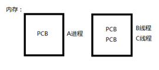

## 线程控制

### 线程概念

LWP：light weight process 轻量级的进程，**本质仍是进程**(在Linux环境下)

**进程：独立地址空间，拥有PCB** 

**线程：有独立的PCB，但没有独立的地址空间(共享)**

区别：在于是否共享地址空间。    独居(进程)；合租(线程)。



Linux下：线程：最小的执行单位；进程：最小分配资源单位，可看成是只有一个线程的进程。


### Linux内核中线程的实现原理

类Unix系统中，早期是没有“线程”概念的，80年代才引入，借助进程机制实现出了线程的概念。因此在这类系统中，进程和线程关系密切。

* 轻量级进程(light-weight process)，也有PCB，创建线程使用的底层函数和进程一样，都是clone

* **从内核里看进程和线程是一样的，都有各自不同的PCB，但是PCB中指向内存资源的三级页表是相同的**

* 进程可以蜕变成线程

* 线程可看做寄存器和栈的集合

* 在linux下，线程最是小的执行单位；进程是最小的分配资源单位

察看LWP号：ps –Lf pid 查看指定线程的lwp号。

> fork创建子进程时父子进程的三级页表虽然相同，实际上父子进程是**指向不同的三级页表，只是内容相同**，一旦其中一个进程修改内容，通过COW机制，父子进程的页表信息就出现差别，因此，父子进程不能共享进程的用户地址空间，
>
> 而同一个进程的两个线程**指向同一个三级页表**，不会出现这种情况，因此，线程可以共享进程的用户的地址空间


### 线程共享和不共享的资源

共享：

* **文件描述符表** 

* **每种信号的处理方式**

  > 如果给一个多线程的进程发送信号，哪个线程抢到信号就谁处理

* 当前工作目录

* 用户ID和组ID

* 内存地址空间 (.text/.data/.bss/heap/共享库，**不包括栈**)

不共享：

* 线程id

* 处理器现场和栈指针(内核栈)

* 独立的栈空间(用户空间栈)

* **errno变量**

  > 虽然errno是全局变量，但是线程不共享

* **信号屏蔽字**

  > 由于线程可以设置不同的信号屏蔽字，故如果给一个多线程的进程发送信号，通过设置不同的信号屏蔽字，可以控制由哪个线程处理信号
  >
  > 但是不推荐线程和信号混用，信号设计之时线程还不存在，两者不是很兼容

* 调度优先级 


### 线程优缺点

​    优点：  1. 提高程序并发性    2. 开销小    3. 数据通信、共享数据方便

​    缺点：  1. 库函数（线程相关的函数不是系统调用），不稳定    2. **调试、编写困难、gdb不支持？**    3. **对信号支持不好**

​    优点相对突出，缺点均不是硬伤。Linux下由于实现方法导致进程、线程差别不是很大。


### 线程控制函数的错误码检查

后续提到的线程控制函数(pthread开头的函数)，**如果异常发生的情况，函数会直接返回errno的值，而不是返回-1**；这个是和其他函数返回-1，需要自己去查询errno的值的方式是不同的

**线程控制函数如果出错，它不会将该线程所属的全局变量errno进行设置**，故切勿通过perror或者使用全局变量errno来打印错误信息，应该使用函数的返回值来打印错误信息，如strerror(返回值)


### pthread_self

```c
   #include <pthread.h>

   pthread_t pthread_self(void);
```

返回调用线程的线程id，本函数对应进程的getpid函数

> 在Linux系统中，pthread_t类型是用unsigned long int实现，而其他的UNIX系统中可能用其他类型（结构体）实现

##### 需要注意

* 线程id是进程内部用于识别线程的标志，不要跨进程使用，两个进程的线程id可能相同
* 线程id和ps -Lf看到的LWP不是一个东西，后者是线程号，是给CPU用来划分时间片的
* 在编码中，不要声明pthread_t类型的全局变量
* 该函数和后续的线程相关函数在编译链接时需要加参数-lpthread


### pthread_create

```c
   #include <pthread.h>

   int pthread_create(pthread_t *thread, const pthread_attr_t *attr,
                      void *(*start_routine) (void *), void *arg);
```

创建一个新线程，本函数对应进程的fork函数，参数信息如下：

* thread：出参，返回新线程的线程id（不能为NULL）
* attr：入参，设置新线程的属性，如果使用线程的默认属性，设置为NULL
* start_routine：入参，设置线程的启动函数
* arg：入参，设置线程启动函数的入参，如果线程的启动函数不需要入参，设置为NULL

创建成功返回0，**异常错误返回errno**，并且*thread的内容是未定义的

> 创建的子线程会去执行start_routine函数，而主线程会继续按照原流程继续执行，可以看出线程的栈空间是不共享的

下面有一个循环创建子线程的**陷阱代码**demo：

```c
#include <iostream>
#include <unistd.h>

using namespace std;

void sys_err(const char *s) {
    perror(s);
    exit(EXIT_FAILURE);
}

void *func(void *arg) {
    cout << "thread " << *(int *)arg << endl;
    return nullptr;
}

int main(int argc, char *argv[]) {
    pthread_t tid{};
    for (int i = 0; i < 5; ++i) {  // 循环创建5个子线程
        auto ret =pthread_create(&tid, nullptr, func, &i);  // 将i的值作为线程启动函数入参
        if (0 != ret) {
            sys_err("pthread_create error");
        }
    }
    sleep(1);  // 防止main函数提前结束而导致创建的5个线程无法执行完全，可以换成pthread_exit(NULL)
}
```

看样子代码没有什么问题，预期的打印结果会如下：

```shell
thread 0
thread 1
thread 2
thread 3
thread 4
```

但是实际的执行结果如下（一种情况）：

```shell
thread 2
thread 2
thread 3
thread 4
thread 5
```

问题在于将i的值作为线程启动函数入参的方式存在问题，这里传入i的时候，传入的是i的地址，线程启动时，也是通过i的地址来访问它的值，但是i的值是在不断变化的，主线程的i在不断累加，导致每个线程在打印i的值时，已经不是创建线程时i的值了

这里可以采取值传递的方法，即将i强制转换成void *类型作为入参，在线程启动函数中再将arg强制转换成long，就可以避免这种情况

> 总结而言，线程启动函数的arg参数传入方式需要慎重，传入地址时，考虑*arg会不会不断变化，如果可能，是否能换成值传递来代替

这个demo还有需要提到的地方：

在main函数中调用了sleep函数将主线程休眠了一段时间，使其他的5个线程先执行完成，如果不这样做，一旦main函数返回到启动例程，内核会释放进程占用的所有资源，并使进程结束运行，其他的五个线程就无法执行完全，不过，**如果在main函数中调用pthread_exit使主线程退出，只要由其他线程存在，不会使进程结束运行**

##### 需要注意

当多线程的进程fork创建子进程时，**子进程中只会保留一个线程，即调用fork函数的那个子线程**，因此，如果多线程和多进程共存使用时，应该父进程应该先fork创建子进程，再调用pthread_create创建自己进程的其他线程，不要反过来（除非你希望子进程只保留一个线程）


### pthread_exit

```c
   #include <pthread.h>

   void pthread_exit(void *retval);
```

使调用线程结束运行，本函数对应进程的exit函数

入参retval指向需要返回的数据，如果无返回，retval为NULL

> 若只需要返回整型值，将整型强转成指针类型进行值传递


### phtread_join

```c
   #include <pthread.h>

   int pthread_join(pthread_t thread, void **retval);
```

阻塞等待线程thread终止运行，本函数对应进程的waitpid函数，通过出参retval获取退出线程的返回数据，调用成功返回0，**异常错误返回errno**

> 这里面也可以通过强制转换实现值传递的方式来使线程返回整形值
>
> ```c
> void *func(void *arg) {
>     return (void *)25;  // 将值类型强制转换成指针类型返回
> }
> 
> int main(int argc, char *argv[]) {
>     pthread_t tid{};
>     pthread_create(&tid, nullptr, func, nullptr);
>     long *s{};
>     pthread_join(tid, (void **)&s);
>     cout << (long)s << endl;  // 将指针类型强制转换成long类型
> }
> ```


### phtread_cancel

```c
   #include <pthread.h>

   int pthread_cancel(pthread_t thread);
```

给线程thread发送取消请求，尝试终止该线程运行，本函数对应进程的kill函数（SIGKILL），调用成功返回0，**异常错误返回errno**

给线程发送取消请求后，线程是否终止运行以及是否终止运行取决于线程的可取消状态和取消类型，参见后续两个函数

##### 需要注意

* phtread_cancel只是给线程发送取消请求，只要发送成功就会返回0，但是线程不一定取消并销毁

* 当被取消的线程终止运行后，其他线程可以调用pthread_join函数获取到PTHREAD_CANCELED作为该线程的退出状态值，其值为(void *)-1

  > 被取消的线程相当于自己执行了pthread_exit(PTHREAD_CANCELED)


### pthread_setcancelstate

```c
   #include <pthread.h>

   int pthread_setcancelstate(int state, int *oldstate);
```

设置调用线程的可取消状态，通过入参state参数来设置：

* PTHREAD_CANCEL_ENABLE：线程可以通过phtread_cancel函数取消，这个状态是线程的**默认状态**
* PTHREAD_CANCEL_DISABLE：线程不可以通过phtread_cancel函数取消，如果线程收到了phtread_cancel函数发送的取消请求，该请求会被阻塞，直到线程状态切换回PTHREAD_CANCEL_ENABLE

通过出参oldstate来获取调用线程旧的可取消状态，若调用成功返回0，**异常错误返回errno**


### pthread_setcanceltype

```c
   #include <pthread.h>

   int pthread_setcanceltype(int type, int *oldtype);
```

设置调用线程的取消类型，通过入参state参数来设置：

* THREAD_CANCEL_DEFERRED：线程会推迟处理phtread_cancel函数发送的取消请求，直到线程下一次调用被称为**取消点**的函数才开始取消，这个状态是线程的**默认状态**

  > 即使线程的取消类型是THREAD_CANCEL_DEFERRED，如果信号处理函数中的取消点函数被调用，其效果就好像线程的PTHREAD_CANCEL_ASYNCHRONOUS状态一样，异步取消

* PTHREAD_CANCEL_ASYNCHRONOUS：线程可以被随时取消，通常情况下，线程收到phtread_cancel函数发送的取消请求后就会立即取消，不过系统不保证这一点

通过出参oldstate来获取调用线程旧的取消类型，若调用成功返回0，**异常错误返回errno**

> pthread_setcancelstate和pthread_setcanceltype这两个函数中的set/get操作相对于进程中调用相同函数的其他线程来说是原子的

**取消点**一般是系统调用，可以参见man 7 pthreads


### pthread_testcancel

```c
   #include <pthread.h>

   void pthread_testcancel(void);
```

为调用线程创建一个取消点，以便原本不包含取消点的线程可以相应phtread_cancel函数发送的取消请求，终止线程运行

> 如果调用线程的可取消状态是PTHREAD_CANCEL_DISABLE，或者线程并未收到取消请求，调用该函数没有任何效果


### phtread_detach

```c
   #include <pthread.h>

   int pthread_detach(pthread_t thread);
```

使线程thread标记为分离状态，当分离状态的线程终止运行时，它的资源将会被内核自动回收，其他线程不允许调用pthread_join去获取它的退出状态，调用成功返回0，**异常错误返回errno**

> 需要注意，若线程终止运行时，若它未被标记为分离状态，则会和线程一样，残留PCB在内核中等待其他线程调用pthread_join会回收，这个是和进程的终止僵尸状态类似，**但是进程没有分离状态机制，故必须处理回收僵尸进程的PCB**
>
> **若其他线程尝试调用pthread_join回收分离状态的线程，会被提示Invalid argument**
>
> 若一个分离状态的进程终止运行后， 其他线程尝试调用pthread_cancel取消它，则没有任何效果


### 线程控制函数与进程控制函数的对比

| 功能         | 进程控制           | 线程控制       |
| ------------ | ------------------ | -------------- |
| 创建         | fork               | pthread_create |
| 获取自身id   | getpid             | pthread_self   |
| 自杀终止运行 | exit、_exit、abort | pthread_exit   |
| 他杀终止运行 | kill               | pthread_cancel |
| 回收         | wait、waitpid      | pthread_join   |
| 分离         | -                  | pthread_detach |


### 线程属性控制

```c
   #include <pthread.h>

   int pthread_attr_init(pthread_attr_t *attr);
   int pthread_attr_destroy(pthread_attr_t *attr);
```

pthread_attr_init：根据指针attr初始化pthread_attr_t结构体，供pthread_create创建新线程时使用

pthread_attr_destroy：销毁已经初始化的pthread_attr_t结构体指针attr，防止内存泄漏

```c
   #include <pthread.h>

   int pthread_attr_setdetachstate(pthread_attr_t *attr, int detachstate);
   int pthread_attr_getdetachstate(const pthread_attr_t *attr, int *detachstate);
```

pthread_attr_setdetachstate：在attr结构体中设置线程分离属性detachstate

pthread_attr_getdetachstate：从attr结构体中获取线程分离属性detachstate，通过出参detachstate返回

分离属性detachstate的取值如下：

* PTHREAD_CREATE_DETACHED：分离状态
* PTHREAD_CREATE_JOINABLE：非分离状态

通过上述函数和pthread_create函数可以使创建的新线程直接处于分离状态，不需要再调用pthread_detach函数

其他的线程属性控制函数待补充

> pthread_attr_t结构体是黑盒结构体，只能通过函数来访问
>
> pthread库没有提供对已有线程获取/设置属性的函数，故在创建新的线程时，如果必要，就可以记录线程的属性


### 线程互斥锁操作

```c
   #include <pthread.h>

   int pthread_mutex_init(pthread_mutex_t *restrict mutex, const pthread_mutexattr_t *restrict attr);
   int pthread_mutex_destroy(pthread_mutex_t *mutex);
   pthread_mutex_t mutex = PTHREAD_MUTEX_INITIALIZER;
```

pthread_mutex_init：根据指针mutex初始化pthread_mutex_t结构体，作为线程互斥锁的句柄，入参attr指定锁的属性，使用锁的默认属性时attr为NULL（**动态初始化**）

pthread_mutex_destroy：根据句柄mutex销毁线程互斥锁，防止内存泄漏

调用成功返回0，异常错误返回errno

> C语言的restrict关键字用于修饰指针类型，它指明指针指向的内存区域只能通过该指针解引用的方式进行修改，不能通过其他指针来修改
>
> 若pthread_mutex_t结构体变量是全局变量或者静态变量，可以使用PTHREAD_MUTEX_INITIALIZER宏来进行**静态初始化**
>
> 互斥锁可以认为是值为1的信号量，加锁使值-1，解锁使值+1，只有值大于0时才能加锁成功，若值不大于0时加锁，这个线程会挂在这个信号量的阻塞队列中并阻塞，若解锁后值不大于0，会从阻塞队列中弹出一个线程唤醒（详细见信号量操作）
>
> 伪代码：
>
> ```c
> 	lock() {
>            --mutex.val;
>            if (mutex.val < 0) {
>                block(pthread_self());
>                mutex.block_que.append(pthread_self());
>            }
>     	}
> 
> 	unlock() {
>            ++mutex.val;
>            if (mutex.val <= 0) {
>                unblock(mutex.block_que.pop());
>            }
>        }
> 
> 	trylock() {
>            if (mutex.val > 0) {
>                --mutex.val;
>                return true;
>            } else {
>                return false;
>            }
>     	}
> ```

```c
   #include <pthread.h>

   int pthread_mutex_lock(pthread_mutex_t *mutex);
   int pthread_mutex_trylock(pthread_mutex_t *mutex);
   int pthread_mutex_unlock(pthread_mutex_t *mutex);
```

pthread_mutex_lock：尝试获取mutex对应的互斥锁，**若锁已被占用，则调用线程被阻塞，直到锁被释放**

pthread_mutex_trylock：尝试获取mutex对应的互斥锁，**若锁已被占用，直接返回相关错误EBUSY**

pthread_mutex_unlock：释放mutex对应的互斥锁

调用成功返回0，异常错误返回errno


### 线程读写锁操作

```c
   #include <pthread.h>

   int pthread_rwlock_init(pthread_rwlock_t *restrict rwlock, const pthread_rwlockattr_t *restrict attr);
   int pthread_rwlock_destroy(pthread_rwlock_t *rwlock);
   pthread_rwlock_t rwlock = PTHREAD_RWLOCK_INITIALIZER;
```

pthread_rwlock_init：根据指针rwlock初始化pthread_rwlock_t结构体，作为线程读写锁的句柄，入参attr指定锁的属性，使用锁的默认属性时attr为NULL（**动态初始化**）

pthread_rwlock_destroy：根据句柄rwlock销毁线程读写锁，防止内存泄漏

调用成功返回0，异常错误返回errno

> 读写锁是“写模式加锁”时， 解锁前，所有对该锁加锁的线程都会被阻塞。
>
> 读写锁是“读模式加锁”时， 如果线程以读模式对其加锁会成功；如果线程以写模式加锁会阻塞。
>
> 读写锁是“读模式加锁”时， 既有试图以写模式加锁的线程，也有试图以读模式加锁的线程。那么读写锁会阻塞随后的读模式锁请求。优先满足写模式锁。**读锁、写锁并行阻塞，写锁优先级高**
>
> 读写锁也叫共享-独占锁。当读写锁以读模式锁住时，它是以共享模式锁住的；当它以写模式锁住时，它是以独占模式锁住的。**写独占、读共享。**
>
> **读写锁非常适合于对数据结构读的次数远大于写的情况**
>
> 若pthread_rwlock_t结构体变量是全局变量或者静态变量，可以使用PTHREAD_RWLOCK_INITIALIZER宏来进行**静态初始化**

```c
   #include <pthread.h>

   int pthread_rwlock_rdlock(pthread_rwlock_t *rwlock);
   int pthread_rwlock_wrlock(pthread_rwlock_t *rwlock);

   int pthread_rwlock_tryrdlock(pthread_rwlock_t *rwlock);
   int pthread_rwlock_trywrlock(pthread_rwlock_t *rwlock);

   int pthread_rwlock_unlock(pthread_rwlock_t *rwlock);
```

pthread_rwlock_rdlock：尝试以读模式获取rwlock对应的读写锁，**若锁已被其他线程以<u>写</u>模式占用（或者有写模式获取锁的线程被阻塞），则调用线程被阻塞，直到锁被释放**

pthread_rwlock_wrlock：尝试以写模式获取rwlock对应的读写锁，**若锁已被其他线程以<u>任意</u>模式占用，则调用线程被阻塞，直到锁被释放**

pthread_rwlock_tryrdlock：尝试以读模式获取rwlock对应的读写锁，**若锁已被其他线程以<u>写</u>模式占用（或者有写模式获取锁的线程被阻塞），直接返回相关错误EBUSY**

pthread_rwlock_trywrlock：尝试以写模式获取rwlock对应的读写锁，**若锁已被其他线程以<u>任意</u>模式占用，直接返回相关错误EBUSY**

pthread_rwlock_unlock：释放rwlock对应的读写锁

调用成功返回0，异常错误返回errno

##### 需要注意

对于写锁的优先级比读锁高的理解，若锁被一个线程以读模式占用，这时，其他线程发来了锁获取的请求，既包括读模式也包括写模式，此时，**读模式获取读写锁会阻塞，不要误认为：锁是被读模式占用，所以读模式获取锁就可以成功，这个前提是阻塞队列没有写模式获取锁的请求**

这样做的原因在于：

* 如果允许读模式获取锁成功，则如果有源源不断的读模式获取锁的请求，则写模式获取锁的线程会饥饿致死
* 允许读模式获取锁成功是没有意义的，写模式获取锁的线程希望修改数据，读模式获取锁后读取的数据也是即将被修改的数据

因此，当阻塞队列里面存在写模式获取锁的请求，即使锁被读模式占用，其他尝试读模式获取锁的线程也会被阻塞，若锁被释放，会优先满足写模式获取锁的请求，后满足读模式获取锁的请求


### 死锁

使用锁不正确的现象，常见的有：

* 同一个线程尝试对同一个锁（除了读锁外）重复获取，即重复加锁（自己等待自己）
* A线程获取了a锁，尝试获取b锁，同时B线程获取了b锁，尝试获取a锁（互相等待）

> 两个线程互相调用pthread_join也会导致这两个线程死锁


### 条件变量操作

条件变量本身不是锁，它经常配合锁来更好地实现线程同步的功能

为什么已经存在了锁，还需要条件变量的存在？

锁虽然可以实现线程之间的互斥和同步机制，但是锁本身没有和线程之间的共享资源进行深度绑定，像之前的互斥锁和读写锁，他们都是为了通过限入临界区（访问共享资源的代码）来实现互斥和同步的，即当线程访问临界区时，其他线程不允许访问，就保证在同一时刻只能由特定线程访问临界区

这些互斥和同步的机制比较简单，如果涉及到复杂的互斥和同步机制就难以完成，比如说生产者和消费者模型中，产品库属于共享资源，生产者将产品放入产品库以及消费者从产品库拿走产品这两个行为是互斥，不可以同时进行的，但是生产者想要将产品放入产品库，以及消费者从产品库取走产品这两个行为的成功进行，**不仅仅受制于两者不能同时进行，还对共享资源数量存在要求，换言之，还有额外条件限制**，生产者不能将产品放入已满的产品库，消费者不能从空的产品库中取走产品，只能等待对方操作完产品库自己才可以进行

因此，条件变量出现了，**用于解决操作共享资源时时需要考虑额外条件的场景，这些仅仅靠锁机制是无法实现的**

```c
   #include <pthread.h>

   int pthread_cond_init(pthread_cond_t *restrict cond, const pthread_condattr_t *restrict attr);
   int pthread_cond_destroy(pthread_cond_t *cond);
   pthread_cond_t cond = PTHREAD_COND_INITIALIZER;
```

pthread_cond_init：根据指针cond初始化pthread_cond_t结构体，作为条件变量的句柄，入参attr指定条件变量的属性，使用条件变量的默认属性时attr为NULL（**动态初始化**）

pthread_cond_destroy：根据句柄cond销毁条件变量，防止内存泄漏

调用成功返回0，异常错误返回errno

```c
   #include <pthread.h>

   int pthread_cond_wait(pthread_cond_t *restrict cond, pthread_mutex_t *restrict mutex);
   int pthread_cond_timedwait(pthread_cond_t *restrict cond, pthread_mutex_t *restrict mutex,
       	const struct timespec *restrict abstime);
```

pthread_cond_wait：阻塞等待条件变量cond条件满足并同时释放互斥锁mutex，直到条件变量cond条件满足时，再次尝试获取互斥锁mutex，调用成功返回0，异常错误返回errno

pthread_cond_timedwait：阻塞等待条件变量cond条件满足并同时释放互斥锁mutex，直到条件变量cond条件满足时，再次尝试获取互斥锁mutex，**但是阻塞时间不是无限的，若阻塞时间超过阈值，线程会停止阻塞，放弃等待条件变量cond条件满足，也不会获取互斥锁**，调用成功返回0，异常错误返回errno

阈值通过参数abstime来设置，其含义是停止阻塞的时刻距离1970-01-01 00:00:00 +0000 (UTC)的时间，称为绝对时间

它的结构体timespec定义如下：

```c
    struct timespec {
        time_t   tv_sec;        /* seconds */
        long     tv_nsec;       /* nanoseconds */
    };
```

获取当前时间的绝对时间可以通过clock_gettime或者time来获取，通过这个绝对时间加上希望阻塞的最长时间（阈值），即为入参abstime

```c
   #include <pthread.h>

   int pthread_cond_broadcast(pthread_cond_t *cond);
   int pthread_cond_signal(pthread_cond_t *cond);
```

pthread_cond_broadcast：给**所有**由于条件变量cond不满足而阻塞的线程发送信号，使条件变量cond满足，这些阻塞的线程就会解除阻塞唤醒并尝试获取互斥锁

pthread_cond_signal：给由于条件变量cond不满足而阻塞的**至少一个**线程（一般是阻塞队列的对头线程，也有可能是内核负责调度）发送信号，使条件变量cond满足，这些阻塞的线程就会解除阻塞唤醒并尝试获取互斥锁

> wait系列函数和上述两个函数搭配使用，是成对的，类似PV操作，P使线程阻塞，V使另一个线程解除阻塞（唤醒）

生产者和多消费者模型的demo如下（可运行）：

```c++
#include <cstdio>
#include <unistd.h>
#include <cstdlib>
#include <pthread.h>
#include <ctime>

void sys_err(const char *s) {
    perror(s);
    exit(EXIT_FAILURE);
}

class Product {
public:
    int code;
    Product *next;
    explicit Product(int code) : code(code), next(nullptr) {}
};

class Store {
private:
    const static int capacity = 10;     // 仓库容量
    int num;                            // 产品数量
    Product *front;                     // 仓库头指针
    Product *tail;                      // 仓库尾指针
public:
    Store() : num(0), front(nullptr), tail(nullptr) {}

    bool empty() const { return num == 0; }
    bool full() const { return num == capacity; }

    bool addProduct(Product *product) {
        if (full() || product == nullptr) {
            return false;
        }
        if (empty()) {
            front = tail = product;
        } else {
            tail->next = product;
            tail = product;
        }
        ++num;
        return true;
    }

    bool removeProduct(Product *&product) {
        if (empty()) {
            return false;
        }
        product = front;
        front = front->next;
        --num;
        if (empty()) {
            front = tail = nullptr;
        }
        return true;
    }

    void print() const {
        printf("[ ");
        for (auto ptr = front; ptr != nullptr; ptr = ptr->next) {
            printf("%d ", ptr->code);
        }
        printf("]\n\n");
    }
};

pthread_cond_t notFull = PTHREAD_COND_INITIALIZER;   // 非空条件变量
pthread_cond_t notEmpty = PTHREAD_COND_INITIALIZER;  // 不满条件变量
pthread_mutex_t mutex = PTHREAD_MUTEX_INITIALIZER;   // 仓库互斥锁
Store store;  // 仓库

/* 生产者线程 */
void *producer(void *arg) {
    srand(time(nullptr));
    while (true) {
        auto *newProduct = new Product(rand() % 100); // 生产一个新产品
        bool isEmpty = store.empty();

        pthread_mutex_lock(&mutex); // 临界区（仓库加锁）
        if (store.full()) {
            printf("[Producer]: store is full, waiting...\n\n");
            pthread_cond_wait(&notFull, &mutex); // 阻塞等待仓库不满的条件满足
            printf("[Producer]: store is not full, continue...\n");
        }
        store.addProduct(newProduct); // 新产品放入仓库
        printf("[Producer]: add product %d, content is ", newProduct->code);
        store.print();
        pthread_mutex_unlock(&mutex); // 临界区（仓库解锁）

        if (isEmpty) {
            pthread_cond_broadcast(&notEmpty); // 发送不满信号，唤醒一个阻塞在条件变量notEmpty上的一个线程
            // 如果是单消费者，可以换成pthread_cond_signal
        }
        sleep(rand() % 2);
    }
}

/* 消费者线程 */
void *consumer(void *arg) {
    long index = (long)arg;
    srand(time(nullptr));
    while (true) {
        Product *newProduct = nullptr;
        bool isFull = store.full();

        pthread_mutex_lock(&mutex); // 临界区（仓库加锁）
        while (store.empty()) {    // 如果是单消费者，可以换成if
            printf("[Consumer %ld]: store is empty, waiting...\n\n", index);
            pthread_cond_wait(&notEmpty, &mutex); // 阻塞等待仓库不空的条件满足
        }
        store.removeProduct(newProduct); // 从仓库取走一个新产品
        printf("[Consumer %ld]: remove product %d, content is ", index, newProduct->code);
        store.print();
        pthread_mutex_unlock(&mutex); // 临界区（仓库解锁）

        delete newProduct; // 消费产品
        if (isFull) {
            pthread_cond_signal(&notFull); // 发送非空信号，唤醒一个阻塞在条件变量notFull上的一个线程
        }
        sleep(rand() % 5);
    }
}


int main(int argc, char *argv[]) {
    pthread_t tid{};
    int ret{};

    ret = pthread_create(&tid, nullptr, producer, nullptr);
    if (0 != ret) {
        pthread_err(ret, "pthread_create producer error");
    }
    pthread_detach(tid);

    for (long i = 0; i < 5; ++i) {
        ret = pthread_create(&tid, nullptr, consumer, (void *)i);
        if (0 != ret) {
            pthread_err(ret, "pthread_create producer error");
        }
        pthread_detach(tid);
    }
    pthread_exit(nullptr);
}
```


### 信号量操作

信号量可以认为是高级的互斥锁，互斥锁在同一时刻最多只能允许一个线程访问临界区，但是信号量在同一时刻最多可以允许N个线程访问临界区，若N = 1，则该信号量的功能就和互斥锁相同

实际上，信号量的本质和PV原语很像，不仅仅可以实现互斥，也可以实现同步机制（先V后P），可以参考408的操作系统

```c
   #include <semaphore.h>

   int sem_init(sem_t *sem, int pshared, unsigned int value);
   int sem_destroy(sem_t *sem);
```

sem_init：根据指针sem初始化sem_t结构体，作为信号量的句柄，入参pshared指定信号量是否进程间共享，0值表示线程间共享，非0值表示进程间共享，入参value指定信号量的初值N

sem_init：根据句柄sem销毁信号量，防止内存泄漏

> 信号量操作不属于pthread库，实际上，信号量不仅仅可以用于线程同步，还可以用于进程同步，如果用于线程同步，信号量必须存放在线程共享区域，如.bss、.data、.heap段等，而如果用于进程同步，信号量必须存放在内存映射区或者共享内存
>
> 但是编译时还是要加-lphtread

调用成功返回0，**异常错误返回-1**

```c
   #include <semaphore.h>

   int sem_wait(sem_t *sem);
   int sem_trywait(sem_t *sem);
   int sem_timedwait(sem_t *sem, const struct timespec *abs_timeout);
```

sem_wait：使信号量sem的值-1，之后，若信号量sem的值为负，则调用线程（进程）阻塞，加入对应的阻塞队列中，直到线程（进程）被唤醒

sem_trywait：若信号量sem的值<=0，则返回-1，errno设置为**EAGAIN**，否则使信号量sem的值-1，返回0（不阻塞）

sem_timedwait：使信号量sem的值-1，之后，若信号量sem的值为负，则调用线程（进程）阻塞，加入对应的阻塞队列中，直到线程（进程）被唤醒，若到了绝对时间abs_timeout线程还没有被唤醒，则返回-1，errno设置为**ETIMEDOUT**

调用成功返回0， 异常错误返回-1（此时信号量的值保持原值）

```c
   #include <semaphore.h>

   int sem_post(sem_t *sem);
```

使信号量值+1，之后，若信号量不为正，则唤醒一个位于阻塞队列中的线程（进程），调用成功返回0， 异常错误返回-1

生产者和多消费者模型的demo如下（可运行）：

```c++
#include <cstdio>
#include <unistd.h>
#include <cstdlib>
#include <pthread.h>
#include <ctime>
#include <semaphore.h>

void sys_err(const char *s) {
    perror(s);
    exit(EXIT_FAILURE);
}

class Product {
public:
    int code;
    Product *next;
    explicit Product(int code) : code(code), next(nullptr) {}
};

class Store {
private:
    const static int capacity = 10;     // 仓库容量
    int num;                            // 产品数量
    Product *front;                     // 仓库头指针
    Product *tail;                      // 仓库尾指针
public:
    Store() : num(0), front(nullptr), tail(nullptr) {}

    bool empty() const { return num == 0; }
    bool full() const { return num == capacity; }

    bool addProduct(Product *product) {
        if (full() || product == nullptr) {
            return false;
        }
        if (empty()) {
            front = tail = product;
        } else {
            tail->next = product;
            tail = product;
        }
        ++num;
        return true;
    }

    bool removeProduct(Product *&product) {
        if (empty()) {
            return false;
        }
        product = front;
        front = front->next;
        --num;
        if (empty()) {
            front = tail = nullptr;
        }
        return true;
    }

    void print() const {
        printf("[ ");
        for (auto ptr = front; ptr != nullptr; ptr = ptr->next) {
            printf("%d ", ptr->code);
        }
        printf("]\n\n");
    }
};

pthread_mutex_t mutex = PTHREAD_MUTEX_INITIALIZER;   // 仓库互斥锁
sem_t emptySem{};                                    // 仓库剩余空间的信号量
sem_t fullSem{};                                     // 仓库现存产品数的信号量
Store store;

/* 生产者线程 */
void *producer(void *arg) {
    srand(time(nullptr));
    while (true) {
        auto *newProduct = new Product(rand() % 100); // 生产一个新产品

        sem_wait(&emptySem);
        pthread_mutex_lock(&mutex);
        store.addProduct(newProduct); // 新产品放入仓库
        printf("[Producer]: add product %d, content is ", newProduct->code);
        store.print();
        pthread_mutex_unlock(&mutex);
        sem_post(&fullSem);

        sleep(rand() % 3);
    }
}

/* 消费者线程 */
void *consumer(void *arg) {
    long index = (long)arg;
    srand(time(nullptr));
    while (true) {
        Product *newProduct = nullptr;

        sem_wait(&fullSem);
        pthread_mutex_lock(&mutex);
        store.removeProduct(newProduct); // 从仓库取走一个新产品
        printf("[Consumer %ld]: remove product %d, content is ", index, newProduct->code);
        store.print();
        pthread_mutex_unlock(&mutex);
        sem_post(&emptySem);

        delete newProduct; // 消费产品
        sleep(rand() % 3);
    }
}


int main(int argc, char *argv[]) {
    sem_init(&emptySem, 0, 10);  // 创建仓库剩余空间的信号量
    sem_init(&fullSem, 0, 0);    // 创建仓库现存产品数的信号量

    pthread_t tid{};
    int ret{};

    ret = pthread_create(&tid, nullptr, producer, nullptr);
    if (0 != ret) {
        pthread_err(ret, "pthread_create producer error");
    }
    pthread_detach(tid);

    for (long i = 0; i < 5; ++i) {
        ret = pthread_create(&tid, nullptr, consumer, (void *)i);
        if (0 != ret) {
            pthread_err(ret, "pthread_create producer error");
        }
        pthread_detach(tid);
    }
    pthread_exit(nullptr);
}
```

