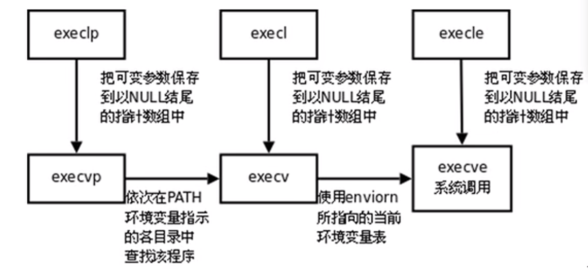

## 进程管理

### 进程控制块PCB存放内容

* **进程id（PID）**
* **进程状态（就绪、运行、阻塞、挂起、终止）**
* **上下文信息（进程切换时需要保存或恢复的寄存器信息）**
* 描述虚拟地址空间的信息（MMU管理的页表信息）
  * 注意，TLB是CPU自己管理的，不需要OS管理

* 描述控制终端的信息
* **当前进程的工作目录current work directory(cwd）**
  * shell中pwd命令显示的是shell终端进程的cwd
* **umask掩码**
  * shell中umask命令显示或设置的是shell终端进程的umask掩码
* **文件描述符表fd_array，包含指向file_struct结构体的指针**
* **信号相关信息**
* **用户id和组id**
* 会话（Session）和进程组
* 进程资源使用上限（Resource Limit）
* **未决信号集**
* **信号屏蔽字**


### 常见环境变量

* PATH：当前终端Shell（进程）解析命令时的搜索路径

* SHELL：当前终端Shell（进程）的执行路径，即Shell进程文件的存放位置
* TERM：当前终端Shell（进程）的类型
* LANG：当前终端Shell（进程）的语言、地区和字符编码信息
* HOME：当前用户的用户家目录


### fork

```c
   #include <sys/types.h>
   #include <unistd.h>

   pid_t fork(void);
```

创建一个子进程，如果异常错误，子进程未被创建并返回-1，如果成功，成功创建一个子进程

* **在父进程中返回新创建的子进程的pid号**
* **在子进程中返回0**

##### 需要注意

* 父进程创建子进程后，系统内核为子进程创建一个PCB，大部分的信息拷贝父进程的PCB（如文件描述符表fd_array，注意，file_struct不拷贝，这意味着文件描述符表共享），不过其中有一部分字段会进行变动，如进程的pid，父进程的pid，进程运行时间，定时器，未决信号集等（注意，信号屏蔽字继承，但是未决信号集不继承）
* 父进程创建子进程后，子进程会拷贝父进程的用户空间内容（比如堆、栈、.data、.text、.rodata、.bss、环境变量、main函数参数、mmap内存映射区），比如父进程有个变量A，虚拟地址为x，创建子进程后，子进程也有变量A，虚拟地址也为x
* Linux引入了**读时共享（share-on-read、SOR）写时复制（copy-on-write、COW）**技术，在fork时子进程拷贝父进程的用户空间内容时，仅仅拷贝了PCB中存放的页表信息，这样两个进程中的用户空间内容实际上在物理空间中是共享的，也就是说，并没有实现物理空间内容的拷贝
* 接上述，由于COW技术，会存在一个物理页框被多个逻辑页映射的情况，这种页框会被操作系统标记为只读页框（被物理共享），当一个进程尝试向只读的物理页框写入数据时，MMU会抛出异常，系统内核会为该进程分配一个新的物理页框并拷贝原物理页框的内容，完成拷贝后MMU进行写入，在这个过程中去掉原物理页框的只读标记

* 接上述，总之，**fork时不马上拷贝物理空间内容，此时物理空间共享，当其中一个进程尝试写内容时才复制需要写入的物理空间并进行写入**

* 由于fork会拷贝栈帧，故在fork调用结束后，父子进程分别从核心态切换到用户态时，内核会根据不同的进程实现返回两个不同的值


### getpid和getppid

```c
   #include <sys/types.h>
   #include <unistd.h>

   pid_t getpid(void);
   pid_t getppid(void);
```

getpid：获取本进程的pid

getppid：获取本进程的父进程id

##### 需要注意

* 在shell终端下执行的可执行文件，该进程的父进程就是shell进程
* 在shell终端下执行的可执行文件，该进程会创建一个新的进程组，自己就是进程组组长


### 进程组

也称之为作业job，BSD于1980年前后向Unix中增加的一个新特性。代表一个或多个进程的集合。每个进程都属于一个进程组。在waitpid函数和kill函数的参数中都曾使用到。操作系统设计的进程组的概念，是为了简化对多个进程的管理

当父进程，创建子进程的时候，默认子进程与父进程属于同一进程组。进程组ID==第一个进程ID(组长进程)。所以，组长进程标识：其进程组ID==其进程ID 

可以使用kill -SIGKILL -进程组ID(负的)来将整个进程组内的进程全部杀死

组长进程可以创建一个进程组，创建该进程组中的进程，然后终止。只要进程组中有一个进程存在，进程组就存在，与组长进程是否终止无关

进程组生存期：进程组创建到最后一个进程离开(终止或转移到另一个进程组)。

一个进程可以为自己或子进程设置进程组ID


### getpgid和setpgid

```c
   #include <sys/types.h>
   #include <unistd.h>

   pid_t getpgid(pid_t pid);
   int setpgid(pid_t pid, pid_t pgid);
```

getpgid：获取指定进程pid的进程组id，若pid为0，则指定本进程，若异常错误返回-1

setpgid：将指定进程pid的进程组设置为pgid，若pid为0，则指定本进程，调用成功返回0，若异常错误返回-1


### getuid和geteuid

```c
       #include <unistd.h>
       #include <sys/types.h>

       uid_t getuid(void);
       uid_t geteuid(void);
```

getuid：获取当前进程实际用户的id

geteuid：获取当前进程有效用户的id

##### 需要注意

* 进程实际用户指的执行进程程序时使用的用户，而进程有效用户指的是进程在运行时使用的用户（身份）
* 进程刚开始运行时，进程有效用户和进程有效用户是相同的，即执行进程程序时使用的用户，当进程改变实际用户时，两者就会不同


### getgid和getegid

```c
       #include <unistd.h>
       #include <sys/types.h>

       gid_t getgid(void);
       gid_t getegid(void);
```

getgid：获取当前进程实际用户组的id

getegid：获取当前进程有效用户组的id


### exec函数族

```c
   #include <unistd.h>

   int execl(const char *pathname, const char *arg, ... /* (char  *) NULL */);
   int execlp(const char *file, const char *arg, ... /* (char  *) NULL */);
   int execle(const char *pathname, const char *arg, ... /*, (char *) NULL, char *const envp[] */);

   int execv(const char *pathname, char *const argv[]);
   int execvp(const char *file, char *const argv[]);
   int execve(const char *pathname, char *const argv[], char *const envp[]);  // system call

   int execvpe(const char *file, char *const argv[], char *const envp[]);
```

让运行的进程去执行给定的可执行程序，从而将旧的控制流替换成新的控制流，不过pid是不变的

**这类函数如果执行成功，程序不会返回且无返回值，只有当异常错误时才有返回值-1**，故不需要对exec类函数的返回值进行判断，直接在后面的代码中打印错误原因，因为后续代码如果会执行，exec类函数一定发生了异常错误，若没有异常错误，后续代码不会执行

由于函数太多，这里来介绍一下函数的后缀是什么意思，不同的后缀意味着参数不同，用法不同

一级后缀（二选一，必选）：

* l（list、命令行参数列表）：第二个参数是逗号分隔的参数列表arg...，列表以NULL指针作为结束标志，比如：

  ```c
  	execl("/bin/ls", "ls", "-al", NULL);
  ```

* v（vector、命令行参数数组）： 第二个参数是一个以NULL结尾的字符串数组的指针argv，比如：

  ```c
  	char *argv[] = {"ls", "-al", NULL};	// cxx11标准存在编译告警(将字符串自面量转换成char *类型)
  	execv("/bin/ls", argv);
  ```

二级后缀（可选）：

* p（PATH、自带路径）：第一个参数是可执行文件名file（不带路径），函数通过环境变量PATH变量查找可执行文件执行

  * 若不带p后缀，第一个参数是可执行文件名pathname（带路径）

* e（environment、环境变量）：需要参入第三个参数envp，比如：

  ```c
  	char *argv[] = {"ls", "-al", NULL};
  	char *envp[] = {"PATH=/bin", NULL};
  	execvpe("ls", argv, env);
  ```

##### 需要注意

* 无论是l后缀还是v后缀，第一个参数是可执行文件的文件名（联想main函数的入参进行理解：argv[0]是可执行文件名）

* 在shell中执行可执行程序的原理就是shell进程调用fork创建子进程然后让子进程调用exec类函数去执行用户指定的可执行程序的

* exec函数族中，只有execve是系统调用（man 2册），其他函数都是调用execve的库函数（man 3册），关系如下（了解）：

  

* 在exec函数执行后中，发生的变化有：
  * 用户空间的内容会被新的可执行程序替换，如.text、.data、.rodata、.bss、堆、栈、main函数参数，若调用时带有e后缀，则环境变量被替换，否则保留
  * PCB内部的绝大部分内容不变，如pid、ppid、umask、uid、euid、gid、egid、cwd、进程运行时间、控制终端信息、资源限制；页表信息会发生改变（因为用户空间变了），文件描述符表可能发生改变，若打开的文件设置了FD_CLOEXEC属性，会在调用exec时关闭


### 孤儿进程和僵尸进程

孤儿进程：**子进程还没结束时，父进程就已经结束了（父亲先死）**，此时，init进程会成为子进程的父进程，称为init进程领养孤儿进程

僵尸进程：**子进程结束后，残留资源尚未被父进程回收时（孩子先死）**，这里的残留资源指的是子进程的PCB，当进程运行结束后，内核会回收该进程的用户空间，但是进程的PCB还残留在内核空间中，等待父进程回收

* 每个进程结束运行后，都会经历僵尸进程的阶段，直到它的父进程将PCB回收才会结束这个阶段
* kill命令可以发送信号终止进程运行，而僵尸进程实际上已经结束运行了，故kill命令不能用于操作僵尸进程

* 可以使用kill命令终止僵尸进程的父进程运行，这样僵尸进程就会被init进程收养，init进程就会自动回收僵尸进程的PCB并结束它的僵尸状态


### wait

```c
   #include <sys/types.h>
   #include <sys/wait.h>

   pid_t wait(int *wstatus); // 1
   pid_t waitpid(pid_t pid, int *wstatus, int options);  // 2
```

阻塞一直等待子进程结束运行，并回收子进程的PCB，从PCB中获取子进程的退出状态，并通过出参wstatus返回，如果不关心子进程的退出状态，入参wstatus可以传NULL，需要注意的是，原型1和2都只能等待一个子进程，不能等待多个子进程

关于wstatus的使用参考如下宏：

```c
	 WIFEXITED(wstatus)         // 进程是否由于调用exit、_exit或者在main函数中return结束运行的（自杀终止）
         
         WEXITSTATUS(wstatus)   // 在上述宏为真时使用，返回exit、_exit调用时的入参或者main函数的返回值
         
     WIFSIGNALED(wstatus)	    // 进程是否由于接收到信号结束运行的（他杀终止）
         
         WTERMSIG(wstatus)      // 在上述宏为真时使用，返回导致进程结束运行的信号值
         
     WCOREDUMP(wstatus)         // 进程是否产生了core dump
```

原型1和2的区别在于：

wait：若有多个子进程，不能指定回收目标子进程回收，系统自动安排回收哪个子进程，若调用成功，返回被回收的子进程的pid，若异常错误，返回-1

waitpid：

* 新增了入参pid，可以用于指定目标子进程，pid的取值具体如下：

| pid  |                       含义                       |
| :--: | :----------------------------------------------: |
| \> 0 |                  等待子进程pid                   |
|  0   | 等待任意子进程，且该子进程和父进程处于同一进程组 |
|  -1  |         等待任意子进程（和wait效果相同）         |
| < -1 |    等待任意子进程，且该子进程的进程组号为-pid    |

* 新增了入参options，可选项包括如下：

|  options   |                             含义                             |
| :--------: | :----------------------------------------------------------: |
|  WNOHANG   |           如果没有子进程退出，则立即返回（非阻塞）           |
| WUNTRACED  | 如果进程接收到信号SIGTSTP或SIGSTOP而停止挂起，函数同样也会返回 |
| WCONTINUED |    如果进程接收到SIGCONT信号而恢复运行，函数同样也会返回     |

由上述options可以得知，**waitpid除了可以等待进程结束运行，还可以等待进程由于信号而挂起停止或者恢复运行**（这三种情况称为**进程的状态发生改变**）

配合新增的功能，waitpid返回的wstatus增加了如下宏：

```c
	 WIFSTOPPED(wstatus)        // 进程是否由于接收到信号而停止挂起的
         
          WSTOPSIG(wstatus)     // 在上述宏为真时使用，返回导致进程停止挂起的信号值
         
     WIFCONTINUED(wstatus)      // 进程是否由于接收到信号SIGCONT而恢复运行的
```
* 返回值：
  * 若调用成功，返回状态发送改变（不仅仅是结束运行被回收的进程，还包括由于信号而挂起停止或者恢复运行的进程）的子进程的pid
  * 若指定了WNOHANG选项，且指定的pid是合法的（确实存在这个子进程），但是状态未发生改变，返回0
  * 若异常错误，返回-1

因此，wait(&wstatus)就等价于waitpid(-1, &wstatus, 0)


### 会话

https://www.cnblogs.com/sparkdev/p/12146305.html

创建会话步骤需要注意：

* 调用进程不能是进程组组长，该进程变成新会话首进程(session header)

* 该进程成为一个新进程组的组长进程。

* 需有root权限 (ubuntu不需要)

* 新会话丢弃原有的控制终端，该会话没有控制终端

* 该调用进程是组长进程，则出错返回

* 建立新会话时，先调用fork, 父进程终止，子进程调用setsid


### getsid

```c
   #include <sys/types.h>
   #include <unistd.h>

   pid_t getsid(pid_t pid);
```

获取进程pid所属的会话id，如果入参pid为0，则获取调用进程所属的会话id，异常错误返回-1


### setsid

```c
   #include <sys/types.h>
   #include <unistd.h>

   pid_t setsid(void);
```

创建一个新会话，以自己的pid设置自己所属的进程组id，同时也是新会话的id，调用成功返回新会话的id，异常错误返回-1

需要注意，**调用进程必须是普通进程，不可以是进程组组长**，创建会话成功后，调用进程将成为进程组的组长，同时也是新会话的首进程

> fork一个子进程时，如果父进程是第一次创建子进程，则会将自己的pid作为新的进程组号，同时，子进程也加入该进程组，进程组号和父进程相同，不过不会创建新会话
>
> getsid(0)和setsid()的返回值是相同的，都是调用进程的pid，但是功能不同
>
> shell进程的pid、pgid和sid一般是相同的，说明shell进程由内核进程创建后调用了setsid创建了新会话，它称为了新会话的首进程，同时也是进程组的组长，并拥有了一个控制终端
>
> 如果原本的进程所在的会话拥有控制终端，创建新会话后，该进程会失去控制终端，如果原本的进程属于前台job，创建新会话后，进程就会转变成新会话的后台job的进程（准确说这个会话已经失去了控制终端，自然也就没有讨论前台和后台的必要，不过肯定不在前台，一般称为守护进程，和控制终端无关


### 守护进程

Daemon(精灵)进程，是Linux中的**后台服务进程**，通常独立于控制终端并且**周期性地执行某种任务或等待处理某些发生的事件**。多用于服务器进程，**一般采用以d结尾的名字**，比如sshd、vsftpd、nfsd、httpd等（不是绝对的）

Linux后台的一些系统服务进程，**没有控制终端，不能直接和用户交互**。**不受用户登录、注销的影响，一直在运行着，**他们都是守护进程。如：预读入缓输出机制的实现；ftp服务器；nfs服务器等

创建守护进程，最关键的一步是调用setsid函数创建一个新的Session，并成为Session Leader

创建步骤：

* **fork创建子进程，随后父进程退出**

  > 因为父进程是进程组组长，无法创建新会话，只能子进程创建，父进程没有存在的必要，故让父进程退出，让子进程被init收养
  >
  > 从shell中输入命令启动的进程也是进程组组长，故fork是必须的

* **在子进程中调用setsid函数创建新会话，称为会话首进程，并脱离控制终端，称为后台进程**

* 通过chdir函数改变子进程的当前目录，建议是根目录（不可卸载的目录）

  > 防止占用可卸载的文件系统

* 通过umask函数重新设文件权限掩码

  >  防止从父进程继承的文件创建屏蔽字拒绝某些权限，增加守护进程灵活性

* 关闭文件描述符表中的打开文件，一般包括STDIN_FILENO、STDOUT_FILENO、STDERR_FILENO

  > 防止从父进程继承的打开文件不会用到，浪费系统资源，如果是设备文件，导致设备文件无法卸载
  >
  > 在部分的编程实践中，STDIN_FILENO、STDOUT_FILENO、STDERR_FILENO并不会关闭，因为若后续守护进程打开新的文件会占用这些已经关闭的数字，造成编程上的陷阱，故可以在文件关闭后，将这三个文件描述符重定向到/dev/null中

* 开始执行守护进程的核心工作内容

demo如下：

```c
#include <iostream>
#include <fcntl.h>
#include <unistd.h>
#include <sys/stat.h>

using namespace std;

void sys_err(const char *s) {
    perror(s);
    exit(EXIT_FAILURE);
}

int main(int argc, char *argv[]) {
    pid_t pid = fork(); // 创建子进程
    if (0 > pid) {
        sys_err("fork error");
    } else if (0 < pid) {
        exit(EXIT_SUCCESS);  // 父进程退出
    }
    
    /* 创建新会话 */
    if (-1 == setsid()) {
        sys_err("setsid error");
    }
    
    /* 改变当前工作目录 */
    if (-1 == chdir("/")) {
        sys_err("chdir error");
    }
    
    /* 改变文件权限掩码 */ 
    umask(0755); 
    
    /* 关闭文件描述符表中的打开文件 */
    int fd = open("/dev/null", O_RDWR);
    if (-1 == fd) {
        sys_err("open error");
    }
    if (-1 == dup2(fd, STDIN_FILENO)) {
        sys_err("dup2 STDIN_FILENO error");
    }
    if (-1 == dup2(fd, STDOUT_FILENO)) {
        sys_err("dup2 STDOUT_FILENO error");
    }
    if (-1 == dup2(fd, STDERR_FILENO)) {
        sys_err("dup2 STDOUT_FILENO error");
    }
    
    /* 开始执行守护进程的核心工作内容 */
    while (true) {
        // TODO
    }
}
```

> 在创建守护进程成功后，通过ps命令查看时，TTY栏显示？，TPGID栏显示-1，表示它所在会话没有控制终端
