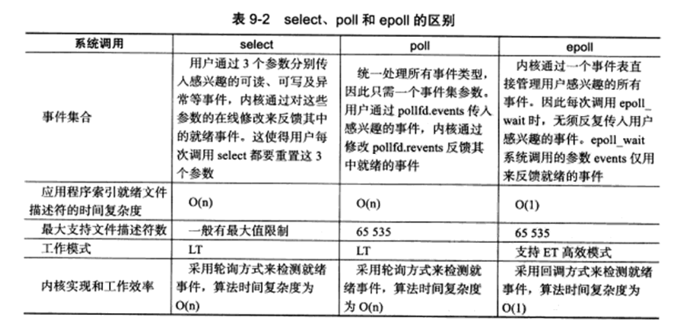
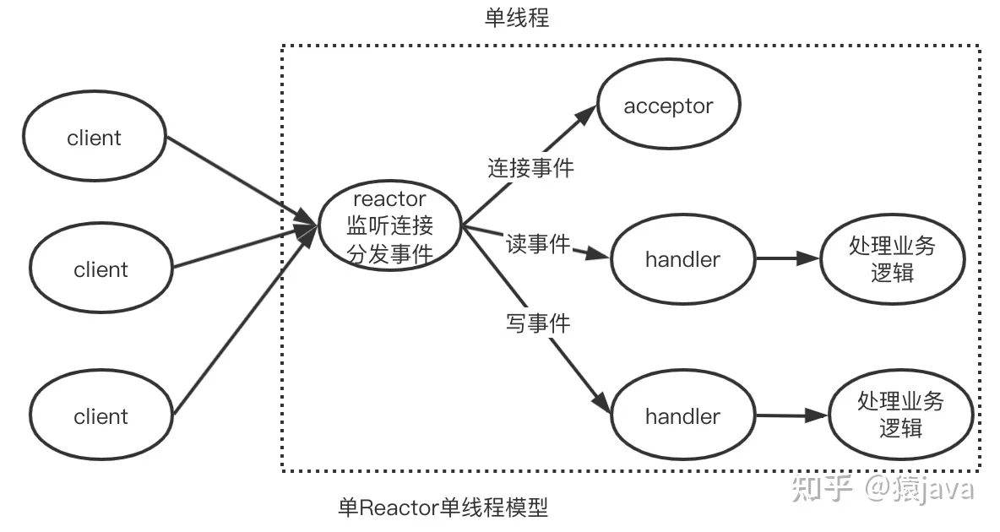

### IO多路复用的概念

传统的socket通信的框架，服务端在处理客户端的连接请求，以及和客户端进行交互时，经常会出现阻塞现象，诸如：监听客户端的连接请求时，accept函数出现阻塞，等待客户端给服务端发送数据时，read函数出现阻塞

这些阻塞现象也导致服务器的效率低下，在阻塞的时间段内不能完成其他事情

因此，IO多路复用的框架是用于解决服务端大量阻塞等待处理的现象，它的思想是：

服务端不再阻塞监听等待**某一个**文件描述符的事件发生，诸如监听socket监听到新连接请求，连接socket接收到客户端发送的数据等等，而是将需要关注的**多个文件描述符进行统一的阻塞监听**，若被关注某些的文件描述符触发了相应的事件，服务端就会获得这些触发事件的文件描述符的列表，再挨个进行处理，此时对文件描述符进行相应的IO操作是不会出现阻塞的

换言之，**IO多路复用即将大量的文件描述符的IO阻塞监听汇总到一起，统一监听**，随后对每一个文件描述符的IO处理都不需要阻塞，从而提高服务器性能

> 通过IO多路复用，服务器采取单进程（线程）就可以实现对多客户端的信息交互，而传统的socket通信则必须采取多进程（线程）才可以实现对多客户端的信息交互


### 文件描述符集合

为了实现IO多路复用，Linux定义了文件描述符集合以及相关操作

文件描述符集合fd_set结构体类似sigset_t结构体，底层都是利用位图来实现的，不过屏蔽了底层细节，并提供部分接口来修改它的内容，包括如下：

```c
   #include <sys/select.h>  
   
   void FD_CLR(int fd, fd_set *set);
   int  FD_ISSET(int fd, fd_set *set);
   void FD_SET(int fd, fd_set *set);
   void FD_ZERO(fd_set *set);
```

FD_CLR：将文件描述符fd从文件描述符集合set中移除

FD_ISSET：判断文件描述符fd在文件描述符集合set中是否存在，若存在返回1，否则返回0

FD_SET：将文件描述符fd添加到文件描述符集合set中

FD_ZERO：将文件描述符集合清空


### select

```c
   #include <sys/select.h>

   int select(int nfds, fd_set *readfds, fd_set *writefds,
              fd_set *exceptfds, struct timeval *timeout);
```

监听多个文件描述符的的事件是否发生，并通过出参返回发生事件的文件描述符的列表，调用成功返回发生事件的文件描述符的个数，异常错误返回-1，参数包括：

* nfds：指明被监听的文件描述符的总数，假设nfds为N，那么被监听的文件描述符的取值范围为[0, N - 1]，**nfds通常取需要监听的所有文件描述符中的最大值加1**
* readfds：被监听**可读**事件的文件描述符集合，若不需要监听可读事件，传入NULL
* writefds：被监听**可写**事件的文件描述符集合，若不需要监听可写事件，传入NULL
* exceptfds：被监听**异常**事件的文件描述符集合，若不需要监听异常事件，传入NULL

> 需要注意，readfds、writefds、exceptfds**即是入参也是出参**
>
> * 做入参时，设置需要监听对应事件的文件描述符的集合
>
> * 作为出参时，会返回发生对应事件的文件描述符的集合

* timeout：用于设置监听的持续时间，设置如下：

  | timeout的参数 |                             含义                             |
  | :-----------: | :----------------------------------------------------------: |
  |     NULL      |    无限期阻塞监听，直到监听到事件或者被信号打断（EINTR）     |
  |       0       |       无阻塞，若没监听到事件则返回0，一般用于轮询处理        |
  |      > 0      | 有限期阻塞监听，直到监听到事件、timeout到时或者被信号打断（EINTR） |

下面是单进程（线程）实现的基于select实现IO多路复用的服务端demo：

```c++
int main() {
    int listenFd = usocket(AF_INET, SOCK_STREAM, 0);
    int opt = 1;
    setsockopt(listenFd, SOL_SOCKET, SO_REUSEADDR, &opt, sizeof(opt));
    sockaddr_in svrAddr{};
    svrAddr.sin_family = AF_INET;
    svrAddr.sin_port = htons(1080);
    svrAddr.sin_addr.s_addr = htonl(INADDR_ANY);
    ubind(listenFd, (const sockaddr *)&svrAddr, sizeof(sockaddr_in));
    ulisten(listenFd, 16);

    fd_set readSet{}, readSetBk{};   // readSet用于出参，获取发生可读事件的集合   readSetBk用于入参，保存需要监听可读事件的集合
    unordered_set<int> allSet;       // 存放所有被监听的连接socket的集合用于检索
    char buf[1024]{};
    int maxFd = listenFd;            // 定义最大fd值
    FD_ZERO(&readSetBk);             // 初始化清空readSetBk
    FD_SET(listenFd, &readSetBk);    // 将监听socket加入需要监听可读事件的集合

    while (true) {
        readSet = readSetBk;
        int fdNum = uselect(maxFd + 1, &readSet, nullptr, nullptr, nullptr);  // 阻塞监听
        if (FD_ISSET(listenFd, &readSet)) {   // 有新的客户端连接请求，即有监听socket的可读事件发生
            sockaddr_in cltAddr{};
            socklen_t cltAddrLen = sizeof(sockaddr_in);
            int connectFd = uaccept(listenFd, (sockaddr *)&cltAddr, &cltAddrLen);
            FD_SET(connectFd, &readSetBk);   // 将新的连接socket加入下一轮的需要监听可读事件发生的集合中
            allSet.emplace(connectFd);
            maxFd = max(connectFd, maxFd);   // 更新最大fd值
            if (0 == --fdNum) {   // 只有监听socket的可读事件发生，即无客户端发送数据，无需处理连接socket，进行下一轮监听
                continue;
            }
        }
        // 处理所有发生可读事件的连接socket
        auto it = allSet.begin();
        while (it != allSet.end()) {
            if (FD_ISSET(*it, &readSet)) {
                ssize_t count = uread(*it, buf, sizeof(buf));
                if (0 == count) {  // 若客户端主动断开连接，则关闭套接字并将对应的连接套接字从需要监听可读事件的集合中移除
                    uclose(*it);
                    FD_CLR(*it, &readSetBk);
                    it = allSet.erase(it);
                    continue;
                }
                // 将客户端发送的字符串中的字母由小写转大写并返回
                for (int i = 0; i < count; ++i) {
                    buf[i] = toupper(buf[i]);
                }
                uwrite(*it, buf, count);
                memset(buf, 0, count);
                // 剩余的发生可读事件的连接socket已经全部处理完成，可以提前跳出循环
                if (0 == --fdNum) {  
                    break;
                }
            }
            ++it;
        }
    }
}
```

> 这个demo中省略了头文件，系统调用封装了一层加了前缀u，用于进行异常情况处理
>
> 这里面用哈希表来存储需要检索的所有文件描述符，存在争议，有人认为没有必要，用数组即可，甚至不使用？

从上述代码中可以看出，**select函数存在一些缺点**，包括：

* 单个进程最多只能监听1024个文件描述符，*除非修改内核*

  > 进程可以打开的默认文件描述符的个数为1024，不过这个数字是可以修改的，这个不是select监听数量受限制的原因，真正的原因在于select在设计时只支持1024个文件描述符，如fd_set结构体中位图最多可以存储1024个文件描述符的状态，这个是固定无法改变的

* 每次调用select函数前都要重新设置fd_set，并且fd_set作为传入传出参数，会存在大量核心态和用户态空间的内容拷贝，开销很大

  > 由于三个fd_set类型的参数作为传入传出参数，如还需要额外定义一个变量来存储入参的值，重新调用前还需要进行用户拷贝
  >
  > select底层在内核态使用一个**数组**来存放文件描述符的事件信息，因此存在核心态和用户态空间的内容拷贝

* select函数内部对文件描述符的监听的通过线性扫描实现的，扫描范围是[0, nfds)，每次调用的时间复杂度为O(n)，而并非按照实际监听的数量来进行扫描的

  > **内部扫描是O(n)**

* 通过select函数返回的结果，仍然需要用户进行线性扫描才能确定发生事件的具体文件描述符

  > **外部扫描是O(n)**，不过可以考虑使用哈希表进行优化

* **select函数的timeout参数若设置阻塞一定时间，那么每次超时后重新调用select函数需要重新设置timeout参数（部分UNIX系统要求）**

不过**select函数也是有优点**的：

* 移植性好，任何类UNIX系统均支持该函数（因为出现的比较早），可跨平台
* select函数对超时精度的控制达到了微妙级


### poll

```c
   #include <poll.h>

   struct pollfd {
       int   fd;         /* file descriptor */
       short events;     /* requested events */
       short revents;    /* returned events */
   };
   
   int poll(struct pollfd *fds, nfds_t nfds, int timeout);
```

poll函数的出现就是为了解决select函数存在的部分缺点的，因此它的功能和select函数的功能是一样的，只是用法上存在不同，其返回值的含义和select完全相同，不同的地方在参数的使用上：

* fds：指向pollfd结构体的数组，该数组用于存储需要监听的所有文件描述符的信息，结构体pollfd的参数信息介绍如下：

  * fd：文件描述符编号

  * events：需要监听的事件类型（作为入参），部分取值包括：

    | events取值 |   含义   |
    | :--------: | :------: |
    |   POLLIN   | 可读事件 |
    |  POLLOUT   | 可写事件 |
    
  * revents：fd对应的events事件是否发生，初始设置为0，作为出参由内核设置，0值表示无事件发生，非0值表示有事件发生，发生的事件包括：
  
    | events取值 |   含义   |
    | :--------: | :------: |
    |   POLLIN   | 可读事件 |
    |  POLLOUT   | 可写事件 |
    |  POLLERR   | 异常事件 |
  
    > 全部的POLL事件取值和用法参见man 2 poll以及poll.h
    >
    > POLL事件支持位操作，**events的设置和revents检测可能也需要位操作**
  
* nfds：fds结构体数组的实际有效长度，也就是poll函数实际监听的文件描述符数量

* timeout：用于设置监听的持续时间，设置如下：

  | timeout取值 |                             含义                             |
  | :---------: | :----------------------------------------------------------: |
  |     -1      |    无限期阻塞监听，直到监听到事件或者被信号打断（EINTR）     |
  |      0      |       无阻塞，若没监听到事件则返回0，一般用于轮询处理        |
  |     > 0     | 有限期阻塞监听，直到监听到事件、timeout到时或者被信号打断（EINTR） |

  > 需要注意，timeout的单位是**毫秒**，而select函数可以达到微秒级控制

下面是单进程（线程）实现的基于poll实现IO多路复用的服务端demo：

```c++
#define MAX_FD 10

int main() {
    int listenFd = usocket(AF_INET, SOCK_STREAM, 0);
    int opt = 1;
    setsockopt(listenFd, SOL_SOCKET, SO_REUSEADDR, &opt, sizeof(opt));
    sockaddr_in svrAddr{};
    svrAddr.sin_family = AF_INET;
    svrAddr.sin_port = htons(1080);
    svrAddr.sin_addr.s_addr = htonl(INADDR_ANY);
    ubind(listenFd, (const sockaddr *)&svrAddr, sizeof(sockaddr_in));
    ulisten(listenFd, 16);

    pollfd fdArray[MAX_FD]{};      // 定义需要监听的文件描述符数组
    fdArray[0].fd = listenFd;
    fdArray[0].events = POLLIN;
    fdArray[0].revents = 0;
    for (int i = 1; i < MAX_FD; ++i) {
        fdArray[i].fd = -1;
    }

    char buf[1024]{};
    int fdCount = 1;            // 定义需要监听的文件描述符个数

    while (true) {
        int fdNum = upoll(fdArray, fdCount, -1);  // 阻塞监听
        if (fdArray[0].revents & POLLIN) {   // 有新的客户端连接请求，即有监听socket的可读事件发生
            sockaddr_in cltAddr{};
            socklen_t cltAddrLen = sizeof(sockaddr_in);
            int connectFd = uaccept(listenFd, (sockaddr *)&cltAddr, &cltAddrLen);
            // 在fdArray中分配位置用于存储新连接connectFd
            int index = 0;
            while (index < MAX_FD) {
                if (fdArray[index].fd == -1) {
                    break;
                }
                ++index;
            }
            // 超出最大连接个数
            if (MAX_FD == index) {
                fprintf(stderr, "max connection error, refuse connect %s:%hu\n", \
                        inet_ntoa(cltAddr.sin_addr), ntohs(cltAddr.sin_port));
                close(connectFd);
            } else {
                fdArray[index].fd = connectFd;
                fdArray[index].events = POLLIN;
                fdArray[index].revents = 0;
                fdCount = max(index + 1, fdCount);   // 更新fdCount值
            }

            if (0 == --fdNum) {   // 只有监听socket的可读事件发生，即无客户端发送数据，无需处理连接socket，进行下一轮监听
                continue;
            }
        }
        // 处理所有发生可读事件的连接socket
        for (int index = 1; index < fdCount; ++index) {
            if (fdArray[index].fd != -1 && (fdArray[index].revents & POLLIN)) {
                ssize_t count = uread(fdArray[index].fd, buf, sizeof(buf));
                if (0 == count) {  // 若客户端主动断开连接，则关闭套接字并将对应的连接套接字从fdArray中移除
                    uclose(fdArray[index].fd);
                    fdArray[index].fd = -1;
                    continue;
                }
                // 将客户端发送的字符串中的字母由小写转大写并返回
                for (int i = 0; i < count; ++i) {
                    buf[i] = toupper(buf[i]);
                }
                uwrite(fdArray[index].fd, buf, count);
                memset(buf, 0, count);
                // 剩余的发生可读事件的连接socket已经全部处理完成，可以提前跳出循环
                if (0 == --fdNum) {
                    break;
                }
            }
        }
    }
}
```

poll函数的**优点**如下：

* 没有函数本身对文件描述符监听数量的限制（和poll函数相同），可以达到系统限制级别

  > 如果存在大量客户端连接，需要修改单进程以及系统能够打开的最大文件描述符数量即可
  >
  > 如何查看和修改参见https://blog.csdn.net/m0_68431045/article/details/128300091

* 将作为入参的需要监听的事件集合与作为出参的发生的事件集合分离，通过结构体数组实现，每次调用前不需要重新设置入参，避免用户层的拷贝行为

* poll函数的timeout参数若设置阻塞一定时间，那么每次超时后重新调用poll函数不需要重新设置timeout参数

**缺点**包括：

* 如果需要监听的文件描述符很多时，仍然会存在大量核心态和用户态空间的内容拷贝

  > poll底层在内核态使用一个**链表**来存放文件描述符的事件信息
  >
  > 这个是select函数遗留缺点，未得到解决

* poll函数内部对文件描述符的监听的通过线性扫描实现的，扫描数量是nfds，每次调用的时间复杂度为O(n)，而并非按照实际监听的数量来进行扫描的

  > 这个是select函数遗留缺点，未得到解决
  >
  > **内部扫描是O(n)**
  >
  > 但是总体而言，poll内部的扫描速度是比select快的（select的无效扫描程度比poll更多），因此性能略比select好

* 通过select函数返回的结果，仍然需要用户进行线性扫描才能确定发生事件的具体文件描述符

  > 这个是select函数遗留缺点，未得到解决
  >
  > **外部扫描是O(n)**

* 移植性不好，部分UNIX不支持poll函数
* select函数对超时精度的控制只有毫秒级，不如select


### epoll

epoll是Linux下多路复用IO接口select/poll的增强版本，它能**显著提高程序在大量并发连接中只有少量活跃的情况下的系统CPU利用率**

* epoll会复用文件描述符集合来传递结果，不用开发者每次等待事件之前都必须重新准备要被监听的文件描述符集合（select存在此问题）
* 在获取事件的时候，epoll无须遍历整个被监听的描述符集，只要遍历那些被内核IO事件异步唤醒而加入Ready队列的描述符集合就行了（select和poll均存在此问题）

下面详细讲述epoll的模型用法：

```c
   #include <sys/epoll.h>

   int epoll_create(int size);
```

创建一个epoll实例，参数size用于指定需要监听的文件描述符的数量，不过该值仅供内核参考，在后续Linux版本中该参数已被忽略，不过必须大于0，调用成功返回epoll实例的文件描述符，异常错误返回-1

> epoll实例可以认为是特殊的文件，它的内部通过**红黑树**来组织所有需要监听的文件描述符，后续都是通过epoll文件描述符来使用epoll

```c
   #include <sys/epoll.h>

   int epoll_ctl(int epfd, int op, int fd, struct epoll_event *event);
```

操作epoll实例，从而设置需要监听的文件描述符或者设置监听的事件类型等，操作成功返回0，异常错误返回-1，参数使用如下：

* epfd：需要操作的epoll实例的文件描述符，由epoll_create创建

* op：操作类型，包括如下：

  |    op取值     |                   含义                    |
  | :-----------: | :---------------------------------------: |
  | EPOLL_CTL_ADD |   将需要监听的文件描述符添加到epoll实例   |
  | EPOLL_CTL_MOD | 修改文件描述符的监听事件属性（event参数） |
  | EPOLL_CTL_DEL |  将不需要监听的文件描述符从epoll实例移除  |

* fd：操作目标，和参数op配合使用

* event：入参，操作内容，用于在EPOLL_CTL_ADD或EPOLL_CTL_MOD操作类型下指定监听事件的属性，**event指向单个结构体，而非结构体数组**，epoll_event结构体的结构如下：

  ```c
      typedef union epoll_data {
          void        *ptr;
          int          fd;
          uint32_t     u32;
          uint64_t     u64;
      } epoll_data_t;
  
      struct epoll_event {
          uint32_t     events;      /* Epoll events */
          epoll_data_t data;        /* User data variable */
      };
  ```

  epoll_event结构体的成员如下：

  * events：需要监听的事件类型，常见的取值包括：
  
    | events取值 |   含义   |
    | :--------: | :------: |
    |  EPOLLIN   | 可读事件 |
    |  EPOLLOUT  | 可写事件 |
    |  EPOLLERR  | 异常事件 |
  
    > 上述取值同样支持位操作，在设置和扫描时需要留意
  
  * data：联合体类型，由四种解释类型，不同的解释类型用法不同，如下所示：
  
    * ptr(void *)：用于实现epoll的Reactor模型，在里面可以添加处理事件的回调函数
    * fd(int)：被监听事件的文件描述符，和epoll_ctl的参数fd的取值相同
    * u32(uint32_t)：自定义使用
    * u64(uint64_t)：自定义使用
  

```c
   #include <sys/epoll.h>

   int epoll_wait(int epfd, struct epoll_event *events, int maxevents, int timeout);
```

阻塞监听epoll实例中的文件描述符，其返回值的含义和select以及poll完全相同，参数使用如下：

* epfd：需要监听的epoll实例的文件描述符，由epoll_create创建，由epoll_ctl设置

* events：入参以及出参，返回epoll实例在监听中发生过事件的epoll_event**结构体数组**，不是指向单个结构体

  > 可以发现，epoll_ctl的入参event就对应select中fd_set的入参用法，epoll_wait的出参events就对应select中fd_set的出参用法，不过event一次只能设置一个，而event一次能返回多个

* maxevents：events数组元素的最大个数，即给events数组分配空间时指定的元素个数

  > maxevents是events作为入参时数组的元素个数，而epoll_wait的返回值才是events作为出参时数组中实际有效的元素个数
  >
  > epoll_wait的返回值用于控制外部扫描的范围

* timeout：用法和poll相同，如下：

  | timeout取值 |                             含义                             |
  | :---------: | :----------------------------------------------------------: |
  |     -1      |    无限期阻塞监听，直到监听到事件或者被信号打断（EINTR）     |
  |      0      |       无阻塞，若没监听到事件则返回0，一般用于轮询处理        |
  |     > 0     | 有限期阻塞监听，直到监听到事件、timeout到时或者被信号打断（EINTR） |

下面是单进程（线程）实现的基于epoll实现IO多路复用的服务端demo：

```c++
int main() {
    int listenFd = usocket(AF_INET, SOCK_STREAM, 0);
    int opt = 1;
    setsockopt(listenFd, SOL_SOCKET, SO_REUSEADDR, &opt, sizeof(opt));
    sockaddr_in svrAddr{};
    svrAddr.sin_family = AF_INET;
    svrAddr.sin_port = htons(1080);
    svrAddr.sin_addr.s_addr = htonl(INADDR_ANY);
    ubind(listenFd, (const sockaddr *)&svrAddr, sizeof(sockaddr_in));
    ulisten(listenFd, 16);

    int epfd = uepoll_create(1024);   // 创建epoll实例
    epoll_event epEvent{};            // epEvent提供给epoll_ctl使用
    epEvent.events = EPOLLIN;
    epEvent.data.fd = listenFd;
    uepoll_ctl(epfd, EPOLL_CTL_ADD, listenFd, &epEvent);   // 将监听socket的可读事件添加到epoll实例中

    epoll_event epEvents[1024]{};     // epEvents提供给epoll_wait使用

    char buf[1024]{};

    while (true) {
        int fdNum = uepoll_wait(epfd, epEvents, sizeof(epEvents) / sizeof(epoll_event), -1);  // 阻塞监听
        // 处理所有发生可读事件的socket
        for (int index = 0; index < fdNum; ++index) {
            if (epEvents[index].data.fd == listenFd) {    // 有新的客户端连接请求
                sockaddr_in cltAddr{};
                socklen_t cltAddrLen = sizeof(sockaddr_in);
                int connectFd = uaccept(listenFd, (sockaddr *)&cltAddr, &cltAddrLen);
                epEvent.events = EPOLLIN;
                epEvent.data.fd = connectFd;
                uepoll_ctl(epfd, EPOLL_CTL_ADD, connectFd, &epEvent);  // 将连接socket的可读事件添加到epoll实例中
            } else {
                ssize_t count = uread(epEvents[index].data.fd, buf, sizeof(buf));
                if (0 == count) {     // 若客户端主动断开连接，则关闭套接字并将对应的连接套接字从epoll实例中移除
                    // op是EPOLL_CTL_DEL时，第四个参数应该为NULL
                    uepoll_ctl(epfd, EPOLL_CTL_DEL, epEvents[index].data.fd, nullptr);
                    // 注意，close不能写在epoll_ctl前面，否则epoll_ctl会报错，文件描述符非法
                    uclose(epEvents[index].data.fd);   
                    continue;
                }
                // 将客户端发送的字符串中的字母由小写转大写并返回
                for (int i = 0; i < count; ++i) {
                    buf[i] = toupper(buf[i]);
                }
                uwrite(epEvents[index].data.fd, buf, count);
                memset(buf, 0, count);
            }
        }
    }
}
```

epoll模型的优点如下：

* 没有函数本身对文件描述符监听数量的限制（和poll函数相同），可以达到系统限制级别

* 将作为入参的需要监听的事件集合与作为出参的发生的事件集合分离，分别通过epoll_ctl和epoll_wait两个函数来控制，编程更加简单

* epoll_wait函数的timeout参数若设置阻塞一定时间，那么每次超时后重新调用epoll_wait函数不需要重新设置timeout参数

* epoll模型内部是通过注册机制来获取发生事件的信息的，epoll实例中通过事件表（红黑树实现）来注册用户希望监听的事件，当内核检测到事件发生时，会调用回调函数来将事件插入到需要返回的事件队列中，时间复杂度为O(1)

  > 内部扫描是O(1)
  >
  > 需要注意，如果有大量连接并且连接都很活跃的情况下，epoll模型会触发大量的回调函数，降低性能，因此epoll模型适用于大量并发连接中只有少量活跃的情况下的系统

* epoll_wait返回的是所有发生事件的集合，用户无需再扫描其中哪个是真正发生事件的文件描述符，时间复杂度为O(1)

  > 外部扫描是O(1)

epoll模型的缺点如下：

* 如果发生事件的文件描述符很多时，仍然会存在大量核心态和用户态空间的内容拷贝

  > epoll模型底层在内核态使用一个**链表**来存放发生事件的集合，通过出参将数据从内核态拷贝到用户态

* 移植性非常不好，只有Linux支持epoll模型
* epoll模型函数对超时精度的控制只有毫秒级，和poll相同


### LT模式和ET模式

epoll事件有两种工作模式：

* 水平触发LT（Level Triggered）：一个事件只要存在，就会一直触发epoll_wait，**它只强调状态满足要求**，意味着若事件没有处理完全或者未处理，下次仍然会触发epoll_wait，一次事件可能会触发多次epoll_wait

* 边缘触发ET（Edge Triggered）：一个事件必须从无到有，才能触发epoll_wait，**它强调状态不仅满足要求的同时还发生了状态变化**，意味着若事件没有处理完全或者未处理，下次就不会触发epoll_wait，一次事件最多会触发一次epoll_wait

  > 以读为例，若一次读取没有将缓冲区的数据读完，还有剩余数据，在下一次循环时
  >
  > * 若采用LT模式，仍然会触发epoll_wait，因为只要文件描述符满足可读事件就可以触发
  > * 采用ET模式，则不会触发epoll_wait，因为文件描述符必须从不可读变迁到可读状态才可以触发
  >
  > 以写为例

需要注意，poll和select模型只支持LT模式，而epoll两者都支持，并且epoll的默认模式是LT模式，**若要采用ET模式，需要在epoll_event结构体的events成员中位或宏EPOLLET**，ET模式是针对事件的，而非整个epoll模型的，epoll中监听的多个事件可以既包含LT模式也包含ET模式

**在使用ET模式时，对应的文件描述符应该设置为非阻塞模式**，分析如下：

在一种场景下，需要传输大量的数据，一次read无法读取全部的数据，需要分批读取

* 若采取ET模式，缓冲区内部未读取完的剩余数据是不会再次触发epoll_wait的，因此用户必须在第一次触发epoll_wait时，就一次性通过循环调用read将数据全部读取出来

  这样很可能造成read阻塞，服务器无法立即调用epoll_wait处理其他套接字，最终使服务器性能降低

  因此采取ET模式时，应该将文件描述符应该设置为非阻塞模式，这样循环调用read不会导致read阻塞，当跳出read循环时，缓冲区中已经为空，也不会影响下一次epoll_wait的触发

* 若采取LT模式，缓冲区内部未读取完的剩余数据是会再次触发epoll_wait的，因此用户没有必要通过循环调用read将数据全部读取出来，自然不会造成read阻塞

> 补充阅读：
>
> 主要是三方面原因：
>
> * 多线程环境下，一个listenfd会被多个epoll（IO多路复用器）对象管理，当一个连接到来时所有的epoll都收到通知，所有的epoll都会去响应，但最终只有一个accept成功；如果使用阻塞，那么其他的epoll将一直被阻塞着。所以最好使用非阻塞IO及时返回。
> * 边沿触发下，事件触发才会读事件，那么需要在一次事件循环中把缓冲区读空；如果使用阻塞模式，那么当读缓冲区的数据被读完后，就会一直阻塞住无法返回。
> * select bug。当某个socket接收缓冲区有新数据分节到达，然后select报告这个socket描述符可读，但随后，协议栈检查到这个新分节检验和错误，然后丢弃了这个分节，这时调用recv/read则无数据可读；如果socket没有设置成nonblocking，此recv/read将阻塞当前线程。

设置非阻塞模式参见fcntl函数

ET模式适用的一个典型场景是，如果发送端发送了数据，但是接收端只需要数据的头部信息，后面的信息不需要，这个时候应该采用ET模型


### select、poll与epoll的区别



更多内容参见《Linux高性能服务器编程》p. 161


### epoll的Reactor模型

又称为反应堆模型，epoll实现Reactor模型是通过epoll_event结构体中的成员data来实现的，data是联合体，里面提供一个成员ptr，为void *类型，它可以自定义epoll事件的私有数据区，**在这个私有数据区中存放处理该事件的回调函数**，**当epoll_wait监听到事件后，不需要判断事件类型，而直接调用处理该事件的回调函数**，这就是Reactor模型的基本思想

以单线程的Reactor模型为例（Redis服务器底层的实现原理）

该模型中分为三个角色，reactor、accepter和handler

* reactor：循环调用epoll_wait，进行IO多路复用监听，将接收到的连接请求交付给accepter处理，将数据IO请求交付handler处理
* acceptor：调用accept接收客户端连接
* handler：分为recv handler和snd handler，分别调用recv和send接收和发送数据

accepter和handler都是回调函数，均由reactor驱动调用，这样实现了事件监听和处理的业务分离，提高了可拓展性

逻辑图如下：



**epoll使用Reactor应该使用ET模式加非阻塞**，从而提高性能

下面是单线程实现Reactor模型的demo，了解思想即可：

```c++
#define MAX_CONNECT 100
#define BUFF_LEN 1024

class EpollReactor;

struct EPollEvent {
    EpollReactor *reactor;  // 用于在static回调函数中访问成员函数
    int index;              // 用于确定在epEvents的索引位置
    int fd;                 // 事件对应的文件描述符
    int event;              // 监听的事件类型
    bool status;            // 是否存在epoll实例（事件表）中
    char buf[BUFF_LEN];     // 事件的私有缓冲区
    long lastTime;          // 上一次设置epoll实例的时间
    ssize_t len;            // 缓冲区长度
    void (*call_back)(void *arg);  // 回调处理函数

    void setEPollEvent(EpollReactor *_reactor, int _index, int _fd, int _event, ssize_t _len, void (*_call_back)(void *arg))  {
        index = _index;
        reactor = _reactor;
        fd = _fd;
        event = _event;
        len = _len;
        call_back = _call_back;
    }
};

class EpollReactor {
public:
    int epfd;  // epoll实例文件描述符
    EPollEvent epEvents[MAX_CONNECT + 1];  // 存储epoll事件信息的数组

    /**
     * 将事件epEvent设置到epoll实例中(添加或修改)
     * @param epEvent epoll事件指针
     */
    void eventSet(EPollEvent *epEvent) const {
        epoll_event event{};
        event.events = epEvent->event;
        event.data.ptr = epEvent;
        int op = epEvent->status ? EPOLL_CTL_MOD : EPOLL_CTL_ADD;
        epEvent->status = true;
        epEvent->lastTime = time(nullptr);
        uepoll_ctl(epfd, op, epEvent->fd, &event);
    }

    /**
     * 将事件epEvent从到epoll实例中移除
     * @param epEvent epoll事件指针
     */
    void eventDel(EPollEvent *epEvent) const {
        if (epEvent->status) {
            epEvent->status = false;
            memset(epEvent->buf, 0, BUFF_LEN);
            epEvent->len = 0;
            uepoll_ctl(epfd, EPOLL_CTL_DEL, epEvent->fd, nullptr);
        }
    }

    /**
     * 创建监听套接字并加入epoll实例中
     */
    void listenReady() {
        int listenFd = usocket(AF_INET, SOCK_STREAM, 0);
        int opt = 1;
        setsockopt(listenFd, SOL_SOCKET, SO_REUSEADDR, &opt, sizeof(opt));
        sockaddr_in svrAddr{};
        svrAddr.sin_family = AF_INET;
        svrAddr.sin_port = htons(1080);
        svrAddr.sin_addr.s_addr = htonl(INADDR_ANY);
        ubind(listenFd, (const sockaddr *)&svrAddr, sizeof(sockaddr_in));
        ulisten(listenFd, 16);

        epfd = uepoll_create(MAX_CONNECT + 1);
        epEvents[MAX_CONNECT].setEPollEvent(this, MAX_CONNECT, listenFd, POLLIN, 0, callbackAcceptConnect);
        eventSet(&epEvents[MAX_CONNECT]);
    }

    /**
     * reactor，不断监听epoll，根据不同的事件类型分发给handler或者accepter
     */
    void run() {
        epoll_event epEvents_a[MAX_CONNECT + 1]{};
        int index = 0;
        while (true) {
            // 若客户端长时间没有数据发送，自动断开连接
            for (int i = 0; i < 10; ++i, ++index) {
                if (MAX_CONNECT == index) {
                    index = 0;
                }
                if (!epEvents[index].status) {
                    continue;
                }
                long during = time(nullptr) - epEvents[index].lastTime;
                if (during >= 20) {
                    eventDel(&epEvents[index]);
                    uclose(epEvents[index].fd);
                }
            }

            // epoll监听并实现事件分发
            int fdNum = uepoll_wait(epfd, epEvents_a, MAX_CONNECT + 1, 1000);
            for (int i = 0; i < fdNum; ++i) {
                if (epEvents_a[i].events & (EPOLLIN | EPOLLOUT)) {
                    auto *epEvent = (EPollEvent *)epEvents_a[i].data.ptr;
                    epEvent->call_back(epEvent);
                }
            }
        }
    }

    /**
     * acceptor，EPOLLIN的回调函数，用于接受连接并将新的事件加入epoll实例中
     * @param arg epoll事件指针
     */
    static void callbackAcceptConnect(void *arg) {
        auto *epEvent = (EPollEvent *)arg;
        auto *_this = epEvent->reactor;
        sockaddr_in cltAddr{};
        socklen_t cltAddrLen = sizeof(sockaddr_in);
        int connectFd = uaccept(epEvent->fd, (sockaddr *)&cltAddr, &cltAddrLen);
        int index = 0;
        while (index < MAX_CONNECT) {
            if (!_this->epEvents[index].status) {
                break;
            }
            ++index;
        }
        if (MAX_CONNECT == index) {
            fprintf(stderr, "max connection error");
            uclose(connectFd);
            return;
        }
        fcntl(connectFd, F_SETFL, fcntl(connectFd, F_GETFL) | O_NONBLOCK);  // 设置非阻塞
        // 将新连接注册callbackRecv回调并添加到epoll实例中，事件类型为EPOLLIN | EPOLLET
        _this->epEvents[index].setEPollEvent(_this, index, connectFd, EPOLLIN | EPOLLET, 0, callbackRecv);
        _this->eventSet(&_this->epEvents[index]);
    }

    /**
     * handler，EPOLLOUT的回调函数，用于发送数据并将事件类型修改为EPOLLIN
     * @param arg epoll事件指针
     */
    static void callbackSend(void *arg) {
        auto *epEvent = (EPollEvent *)arg;
        EpollReactor *_this = epEvent->reactor;
        int index = epEvent->index;
        ssize_t count = uwrite(epEvent->fd, epEvent->buf, epEvent->len);
        if (count != epEvent->len) {
            fprintf(stderr, "write error, msg = %ld, realSnd = %ld", epEvent->len, count);
            _this->eventDel(&_this->epEvents[index]);
            uclose(epEvent->fd);
        } else {
            memset(_this->epEvents[index].buf, 0, BUFF_LEN);
            // 将原连接注册的回调函数修改为callbackRecv，事件类型修改为EPOLLIN | EPOLLET，用于下一次epoll监听后调用
            _this->epEvents[index].setEPollEvent(_this, index, epEvent->fd, EPOLLIN | EPOLLET, 0, callbackRecv);
            _this->eventSet(&_this->epEvents[index]);
        }
    }

    /**
     * handler，EPOLLIN的回调函数，用于接收数据并将事件类型修改为EPOLLOUT
     * @param arg epoll事件指针
     */
    static void callbackRecv(void *arg) {
        auto *epEvent = (EPollEvent *)arg;
        EpollReactor *_this = epEvent->reactor;
        int index = epEvent->index;
        ssize_t count = uread(epEvent->fd, epEvent->buf, BUFF_LEN);
        if (0 == count) {
            _this->eventDel(epEvent);
            uclose(epEvent->fd);
        } else {
            // 将客户端发送的字符串中的字母由小写转大写
            for (int i = 0; i < count; ++i) {
                epEvent->buf[i] = toupper(epEvent->buf[i]);
            }
            // 将原连接注册的回调函数修改为callbackSend，事件类型修改为EPOLLOUT，用于下一次epoll监听后调用
            _this->epEvents[index].setEPollEvent(_this, index, epEvent->fd, EPOLLOUT, count, callbackSend);
            _this->eventSet(&_this->epEvents[index]);
        }
    }
};

int main() {
    EpollReactor epollReactor{};
    epollReactor.listenReady();
    epollReactor.run();
}
```

