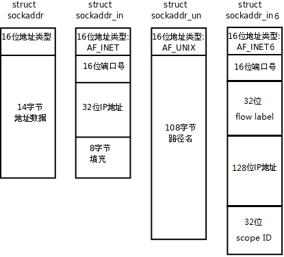

### IP地址相关函数

下面涉及到的IP或者端口的数据类型，若是整型，则是二进制表示，若是字符串，则是点分十进制表示

```c
   #include <arpa/inet.h>

   uint32_t htonl(uint32_t hostlong);
   uint16_t htons(uint16_t hostshort);
   uint32_t ntohl(uint32_t netlong);
   uint16_t ntohs(uint16_t netshort);
```

htonl：将4B数据由主机字节序转换网络字节序（可用于转换IPv4地址使用）

htons：将2B数据由主机字节序转换网络字节序（可用于转换端口号使用）

ntohl：将4B数据由网络字节序转换主机字节序

ntohs：将2B数据由网络字节序转换主机字节序

```c
   #include <arpa/inet.h>

    typedef uint32_t in_addr_t;
    struct in_addr {
        in_addr_t s_addr;
    };

   int inet_aton(const char *cp, struct in_addr *inp);
   char *inet_ntoa(struct in_addr in);
```

inet_aton：将IPv4地址进行格式转换，由**字符串(cp)** 转换成**网络字节序的数值(inp)**，转换成功返回1，异常错误返回0（不设置errno）

inet_ntoa：将IPv4地址进行格式转换，由**网络字节序数值(in)** 转换成**字符串(返回值)**，转换成功返回字符串首地址，异常错误返回NULL

> 上述两个函数异常错误不设置errno
>
> inet_ntoa返回的指针指向函数内部的字符数组静态变量，该函数不可重入，但是线程安全
>
> 对于in_addr结构体只用一个成员而为什么保留的原因，因为早期in_addr结构体中有不止一个成员，随着版本更迭，其他成员都被移除，而为了兼容性，结构体仍然保留
>
> **上述两个函数不推荐使用（供阅读代码了解，编程不要使用）**

```c
   #include <arpa/inet.h>

   typedef uint32_t in_addr_t;

   in_addr_t inet_addr(const char *cp);
   in_addr_t inet_network(const char *cp);
```

inet_addr：将IPv4地址进行格式转换，由**字符串(cp)** 转换成**网络字节序的数值(返回值)**，转换成功返回结果，异常错误返回-1

inet_network：将IPv4地址进行格式转换，由**字符串(cp)** 转换成**主机字节序的数值(返回值)**，转换成功返回结果，异常错误返回-1

> 上述两个函数异常错误不设置errno
>
> 注意别把两个函数的功能搞反了
>
> 上述两个函数返回的-1可以表示有效IP地址255.255.255.255，因此当返回-1时可能并没有发生错误，**上述两个函数不推荐使用（供阅读代码了解，编程不要使用）**

```c
   #include <arpa/inet.h>

   int inet_pton(int af, const char *src, void *dst);
   const char *inet_ntop(int af, const void *src, char *dst, socklen_t size);
```

inet_pton：将IPv4地址进行格式转换，由**字符串(src)** 转换成**网络字节序的数值(dst)**，转换成功返回1，转换失败返回0，异常错误返回-1

inet_ntop：将IPv4地址进行格式转换，由**网络字节序的数值(src)** 转换成**字符串(dst)**，转换成功返回字符串首地址，异常错误返回NULL

> p指代presentation（表示），n指代numeric（数值）
>
> 上述两个函数异常错误会设置errno

af参数的定义如下：

| af参数   | 含义       |
| -------- | ---------- |
| AF_INET  | IPv4地址族 |
| AF_INET6 | IPv6地址族 |

由于上述两个函数可以支持两种地址族，故inet_pton的dst参数以及inet_ntop的src参数均是void*类型

* 若af为AF_INET，指针指向的内存大小应该为4，常用的类型如in_addr_t、in_addr、uint32_t
* 若af为AF_INET，指针指向的内存大小应该为16，如何实现待补充

inet_ntop的size参数用于指定出参dst缓冲区的大小


### sockaddr结构体

```c
    struct sockaddr {
        sa_family_t sa_family;  // 地址族类型（兼容其他各种地址族结构体类型）
        char sa_data[14];       // 其他数据（不兼容其他各种地址族结构体类型）
    };
```

描述了类UNIX操作系统进行socket通信时存放的地址信息格式

> sockaddr结构体是伴随着UNIX网络编程接口的出现而出现的，当时IPv4协议都还没有出现，那个时候使用这个结构体进行编程，直到其他各种类型的地址族协议出现，为了使老的接口原型兼容新的地址族协议（接口类型一旦确定不能随意更改的），sockaddr结构体逐渐失去了本身的功能，**充当通用类型（类似void *）的作用**，不能直接使用在网络编程接口中，而其他各种地址族类型的地址需要使用网络编程接口，就**需要将它的指针类型强制转换成sockaddr *类型才可以使用**

sockaddr的参数sa_family指明了地址族类型，常见的类型如下所示：

| sa_family |     含义     | 对应结构体类型 |
| :-------: | :----------: | :------------: |
|  AF_INET  |  IPv4地址族  | socketaddr_in  |
| AF_INET6  |  IPv6地址族  | socketaddr_in6 |
|  AF_UNIX  | UNIX域地址族 | socketaddr_un  |
| AF_UNSPEC | 未指定地址族 |       -        |

下面是各种常见地址族的地址类型的字节分布（可以看出大小可能是不同的）：



sockaddr_in结构体的格式如下

```c
    /* Internet address. */
    struct in_addr {
        uint32_t       s_addr;     /* address in network byte order */
    };

	struct sockaddr_in {
        sa_family_t    sin_family; /* address family: AF_INET */
        in_port_t      sin_port;   /* port in network byte order */
        struct in_addr sin_addr;   /* internet address */
    };
```

参数包括：

* sin_family，地址族类型，取值为AF_INET
* sin_port，端口号，注意是网络字节序
* sin_addr.s_addr，IPv4地址，注意是网络字节序


### 常见的IP地址宏

| 地址宏           | 对应地址        | 解释                                                         |
| ---------------- | --------------- | ------------------------------------------------------------ |
| INADDR_ANY       | 0.0.0.0         | 任意地址，常用于服务端监听socket时，指定socket的IP地址为服务器拥有的所有网卡的IP地址 |
| INADDR_BROADCAST | 255.255.255.255 | 本地广播地址                                                 |
| INADDR_LOOPBACK  | 127.0.0.1       | 环回地址                                                     |
| INADDR_NONE      | 255.255.255.255 | 错误地址，inet_addr和inet_network函数调用错误时会返回        |

> 上述IP地址宏均为主机字节序类型


### socketTCP通信流程框架


### socket

```c
   #include <sys/types.h>
   #include <sys/socket.h>

   int socket(int domain, int type, int protocol);
```

创建一个socket并返回文件描述符，异常错误返回-1

参数如下：

* domain：指定socket通信时使用的地址族，参见结构体sockaddr中参数sa_family的定义

* type：指定socket类型，常见的取值如下：

  |     type      |              含义               |
  | :-----------: | :-----------------------------: |
  | SOCKET_STREAM | 基于字节流的socket，用于TCP通信 |
  | SOCKET_DGRAM  | 基于数据报的socket，用于UDP通信 |

* protocol：指定代表通信协议的编号，一般设置为0，由内核根据参数domain和type来选择代表协议的类型

> socket函数创建的套接字的默认类型是主动类型，称为主动套接字，可以主动向其他主机发出连接请求


### bind

```c
   #include <sys/types.h>          /* See NOTES */
   #include <sys/socket.h>

   int bind(int sockfd, const struct sockaddr *addr, socklen_t addrlen);
```

将socket套接字sockfd绑定地址信息addr，addrlen指定了地址信息addr的空间长度，调用成功返回0，异常错误返回-1


### listen

```c
   #include <sys/types.h>          /* See NOTES */
   #include <sys/socket.h>

   int listen(int sockfd, int backlog);
```

将socket套接字sockfd的模式设置为被动模式，并设置连接请求队列的最大长度为backlog，调用成功返回0，异常错误返回-1

> 调用listen函数后，sockfd的模式就从主动模式转换成被动模式，称为被动套接字，只能被动接受连接请求而不能发起连接请求
>
> **调用listen函数后，套接字的状态就由CLOSE转换成LISTEN**
>
> 若socket套接字未绑定地址信息就开始调用listen，内核会选择本机的IP地址和系统分配的端口号作为地址信息，称为隐式绑定
>
> 连接请求队列中存放的是尚未接受的socket连接请求，换言之，**backlog指定了尚未接受的连接请求的最大数量，而非与服务端建立连接的客户端最大数量**，若在短时间内接收到的连接请求数超过backlog，则可能会丢弃超出的连接请求，客户端的connect函数可能会收到ECONNREFUSED错误
>
> 实际上，连接请求队列的最大长度为min(backlog, /proc/sys/net/core/somaxconn)，内核参数/proc/sys/net/core/somaxconn参数用于限制连接请求队列的最大值
>
> 后续内容中会提到，这里面的连接请求队列即全连接队列
>
> 本函数不会阻塞，当调用完该函数后，**由内核开始负责进行监听，而用户程序可以继续执行**


### accept

```c
   #include <sys/types.h>
   #include <sys/socket.h>

   int accept(int sockfd, struct sockaddr *addr, socklen_t *addrlen);
```

从socket套接字sockfd对应的连接请求队列中取出一个socket连接请求，表示接受该连接请求，并通过出参addr返回请求方socket绑定的地址信息，同时通过出参addrlen返回了该地址信息的空间长度，**调用成功则返回用于和该请求方进行通信的socket文件描述符，异常错误返回-1，若连接请求队列为空，则函数阻塞，直到连接请求队列中加入新的socket连接请求**

> addrlen虽然是出参，但是对初值也有要求，初值必须是addr指向类型的大小


### connect

```c
   #include <sys/types.h>
   #include <sys/socket.h>

   int connect(int sockfd, const struct sockaddr *addr, socklen_t addrlen);
```

通过socket套接字sockfd向服务端建立连接，服务端监听socket的地址信息由addr指定，其长度由addrlen，成功建立连接返回0，异常错误返回-1

> 若socket套接字未绑定地址信息就开始调用connect，内核会选择本机的IP地址和系统分配的端口号作为地址信息，称为隐式绑定
>
> 客户端一般会利用这种特性，省去调用bind的环节，因为客户端的端口号不需要指定，但是服务端的端口号是确定的，不能跳过绑定地址信息的操作


### 三次握手原理

三次握手是由客户端调用connect函数发起的，具体的流程图如下所示：


当服务端调用listen后，**服务端套接字状态由CLOSE转换成LISTEN**，当客户端调用connect后，**客户端套接字状态由CLOSE转换成SYN_SENT**，此时触发三次握手，在三次握手阶段，内核负责控制两个队列，**半连接队列（syn队列）和全连接队列（accept队列）**

* 第一次握手SYN：客户端发送连接请求给服务端，服务端接收到请求后判断半连接队列是否为满，若已满会丢弃请求或者回送RST报文，若半连接队列没满，则弹出队列并加入半连接队列，**服务端套接字状态由LISTEN转换成SYN_RECV**，并发起第二次握手SYN+ACK
* 第二次握手SYN+ACK：服务端发送连接确认给客户端，**客户端接收到确认后套接字状态由SYN_RECV转换成ESTABLISHED**，并发起第三次握手ACK
* 第三次握手ACK：客户端发送连接确认给服务端，服务端接收到确实后判断全连接队列是否为满，若已满会丢弃请求或者回送RST报文，若全连接队列没满，则从半连接队列中弹出对应请求，并加入全连接队列，**服务端套接字状态由SYN_RECV转换成ESTABLISHED**

> 内核参数/proc/sys/net/ipv4/tcp_abort_on_overflow用于控制半/连接队列满时内核的处理方式，若为1，则回送RST报文，若为0，则丢弃，客户端收到RST报文后，connect函数会报错，errno置ECONNRESET（Connection reset by peer）

**上述三次握手的过程都是由内核来组织的**，当完成三次握手后，服务端才可以调用accept函数取走全连接队列中的连接请求，并进行socket通信，*有种说法，当完成第一次握手后，TCP处于半连接状态，当完成第三次握手后，TCP处于全连接状态*

> 半连接队列的大小由内核参数/proc/sys/net/ipv4/tcp_max_syn_backlog指定
>
> 全连接队列的大小由listen函数的参数backlog和内核参数/proc/sys/net/core/somaxconn指定，为min(backlog, /proc/sys/net/core/somaxconn)
>
> 以上适用于Linux 2.2以后的内核版本

三次握手若出现异常：

* 在客户端发起第一次握手SYN后，客户端在指定时间内没有收到服务端的第二次握手SYN+ACK，则触发超时重发，超时重传时间由内核指定，不可修改，重复次数由内核参数/proc/sys/net/ipv4/tcp_syn_retries指定，超过一定次数，客户端connect函数会报错，errno置ETIMEOUT（Connection timed out）

  > 客户端没有收到第二次握手的原因很多，第一次或者第二次握手丢失，数据损坏，服务端半连接队列已满等等

* 在服务端发起第二次握手SYN+ACK后，服务端在指定时间内没有收到客户端的第三次握手ACK，则触发超时重发，超时重传时间由内核指定，不可修改，重传次数由内核参数/proc/sys/net/ipv4/tcp_synack_retries指定，超过一定次数，服务端会放弃该连接，将请求从半连接队列移除，并将套接字状态重置

  > 服务端没有收到第三次握手的原因很多，第二次或者第三次握手丢失，数据损坏，**还有可能是客户端故意不进行第三次握手，这就是SYN攻击的原理**
  >
  > 客户端可以伪造假的IP发送地址，导致第二次握手不可达，这样就会让服务端监听套接字卡在SYN_RECV状态，连接请求也会卡在半连接队列中，并且不断超时重发
  >
  > 若这种恶意客户端数量很多，会导致大量的连接请求堆积在半连接队列中，最终使半连接队列占满，无法响应正常客户端的连接请求，使服务端瘫痪无法响应服务（虽然前面提到服务端超时重发到一定次数后会放弃该连接，但是这个速度远远小于客户端的请求速度）
  >
  > 解决这种问题的方法有：
  >
  > * 增加半连接队列大小，同样，也应该增加全连接队列大小，这样半连接队列变满的速度会变慢
  > * 开启tcp_syncookies功能：
  >   * 开启这个功能后会不使用半连接队列实现三次握手，当客户端发起第一次握手SYN时，服务端根据第一次握手的信息构造cookie值通过第二次握手SYN+ACK发送给客户端，客户端根据算法构造新的cookie通过第三次握手带回给服务端，服务端验证cookie通过后将其加入全连接队列
  >   * 这个方法虽然可以解决SYN攻击问题，但本身也存在一些问题，参见https://zhuanlan.zhihu.com/p/357887244
  > * 减少第二次握手SYN+ACK的重传次数，这样服务器能够更快速地放弃恶意连接
  >
  > SYN攻击也是DoS（Denial of Service）拒绝服务攻击的一种

* 在客户端收到第二次握手SYN+ACK后，但是第三次握手失败，客户端无法感知这个情况，它的状态已经切换成ESTABLISHED，在这种情况下：

  * 若客户端没有需要发送的数据，会利用TCP保活机制来检测对端，若服务端没有进行回应，检查失败后会重置状态为CLOSE
  * 若客户端有需要发送的数据，发送数据后，若服务端没有进行回应，客户端就会发现连接失败，重置状态为CLOSE

  > 第三次握手失败的原因很多，第三次握手ACK丢失或者全连接队列已满等等

  这种情况下，TCP采取的一种补救措施是，客户端发起第三次握手后，随后在它发送数据时，会设置ACK标志，若恰好第三次握手失败，这次捎带的ACK标志可以作为后备握手，只要服务端没有超时废弃该连接，连接还是可能成功建立的


### 四次握手原理

四次握手是由客户端调用close函数（主动调用或者进程终止运行）发起的，需要注意，**四次握手中的客户端未必是三次握手中的客户端，两端谁先调用close函数谁就是客户端，即主动关闭的一方是客户端**，具体的流程图如下所示： 


当客户端调用close后，**服务端套接字状态由ESTABLISHED转换成FIN_WAIT_1**，并触发四次握手

* 第一次握手FIN，客户端发送断开连接请求给服务端，服务端接收到请求后，**服务端套接字状态由ESTABLISHED转换成CLOSE_WAIT**，**此时服务端调用read函数可以读出的字节数为0**，并发起第二次握手ACK
* 第二次握手ACK，服务端发送断开连接确认给客户端，客户端接收到确认后，**客户端套接字状态由FIN_WAIT_1转换成FIN_WAIT_2**

完成前两次握手后，客户端和服务端之间处于**半关闭状态**，这种状态下，**客户端不再向服务端发送数据，但是可以继续接收服务端的数据**，只有等到服务端调用close后，**服务端套接字状态由CLOSE_WAIT转换成LAST_ACK**，并触发第三次握手FIN+ACK

* 第三次握手FIN+ACK，服务端发送断开连接请求给客户端，客户端收到请求后，**客户端套接字状态有FIN_WAIT_2转换成TIME_WAIT**，并发起第四次握手ACK
* 第四次握手ACK，客户端发送断开连接确认给服务端，服务端接收到确认后，**服务端套接字状态由LAST_ACK转换成CLOSED**

上述四次握手的过程都是由内核来组织的，**不过前两次握手的触发时机是客户端调用close，后两次握手的触发时机是服务端调用close**

若四次握手出现异常：

* 在客户端发起第一次握手FIN后，客户端在指定时间内没有收到服务端的第二次握手ACK，则触发超时重发，超过一定次数，客户端直接关闭连接，客户端套接字状态由FIN_WAIT_1转换成CLOSE

  * 若是第一次握手FIN丢失，服务端无法感知到客户端第一次握手，但是过了一段时间后，服务端保活机制探测到对端不存在，也会关闭连接，客户端套接字状态由ESTABLISHED转换成CLOSE
  * 若是第二次握手ACK丢失，服务端虽然感知到客户端第一次握手，但是ACK报文是不会重发的，不过TCP会在第三次握手时将这个ACK确认捎带进去，这样，若客户端收到第三次握手FIN+ACK，客户端套接字由FIN_WAIT_1转换成TIME_WAIT

* 在客户端完成两次握手后进入FIN_WAIT_2状态，客户端在指定时间内没有收到服务端的第三次握手FIN+ACK，客户端直接关闭连接，套接字状态由FIN_WAIT_2转换成CLOSE

  > 发生这种情况的原因很多，如服务端代码漏洞，没有主动发起第三次握手FIN，服务端宕机，第三次握手丢失等等
  >
  > 这个阶段的超时时间由内核参数/proc/sys/net/ipv4/tcp_fin_timeout指出

* 在服务端发起第三次握手FIN+ACK后，服务端在指定时间内没有收到客户端的第四次握手ACK，则触发超时重发，超过一定次数，服务端直接关闭连接，服务端套接字由LAST_ACK转换成CLOSE

  * 若是第三次握手FIN+ACK丢失，即上一条异常情况

    > 需要提到的有个场景是，若客户端程序异常退出，导致第三次握手不可达，在服务端不断重发的时间段内，客户端程序重新连接，发起第一次握手SYN，此时服务端会无视这个SYN，继续发送FIN+ACK，而这个不是客户端期待的第二次握手ACK，故**客户端会发送RST报文告诉服务端重置连接**，服务端接收到RST报文后，服务端套接字由LAST_ACK转换成CLOSE，关闭废弃连接，让客户端重新发起连接

  * 若是第四次握手ACK丢失，客户端无法确认服务端是否已经关闭连接，如果直接关闭连接，服务端超时重发第三次握手FIN+ACK，只会接收到客户端的RST报文，服务端会以为断开连接时发生了错误，因此在客户端套接字在发起第四次握手ACK后需要进入持续时长为2MSL（最长报文端生存期）的TIME_WAIT状态，1MSL用于预留给第四次握手ACK的时间，2MSL用于预留重发的第三次握手FIN+ACK，**在2MSL时间内，能够确保接收到服务端重发的第三次握手FIN+ACK，从而重新进行第四次握手ACK**

    > TIME_WAIT状态除了上述的功能之外，还可以用于**销毁网络中滞后的无效TCP报文**，如果双方在TCP通信过程中由报文出现了滞后，随后重传报文成功了，双方断开了TCP连接后又以相同的IP和端口建立了TCP连接，这时滞后的报文到达了目的端，会对通信产生干扰
    >
    > 预留了TIME_WAIT状态后，在这个状态中，连接仍然保持2MSL的时间，同时不能以相同的IP和端口建立新的连接，此时滞后的报文若到达了目的端，会被目的端忽略掉，从而一定程度上可以销毁网络中滞后的无效TCP报文
    >
    > 当然，TIME_WAIT状态也会存在问题，若服务器因为异常情况下主动断开连接，导致有很长的一段时间（2MSL参考时间2min）卡在TIME_WAIT状态，导致服务端的端口一直被占用，无法通过原端口创建新的监听套接字，而服务器的端口号是不能改变的，这导致服务器在2MSL的时间内无法重启服务，对于商业环境是无法忍受的，因此，**TCP提供端口复用机制，可以为套接字增加SO_REUSEADDR属性（见端口复用）**，若套接字卡在TIME_WAIT状态，服务端仍然可以用该套接字的IP和端口创建新的套接字，避免重启服务存在空档期


### TCP断开连接的两个常见场景分析

假设服务端在检测到客户端发起四次握手后，会调用close触发第三次握手

假设客户端在检测到服务端发起四次握手后，不会调用close触发第三次握手

* 客户端退出：客户端套接字会在**TIME_WAIT**状态卡2min，最后切换到CLOSE状态

* 服务端退出：服务端套接字会在**FIN_WAIT_2**半关闭状态卡住（因为服务端退出时会自动关闭socket，触发四次握手，但是客户端不会触发第三次握手）

  * 若服务端在卡FIN_WAIT_2的时间内，客户端也退出，服务端套接字会切换到**TIME_WAIT**状态卡2MSL的时间（因为客户端退出时会自动关闭socket，触发第三次握手），最后切换到CLOSE状态
  * 若服务端在卡FIN_WAIT_2的时间内，客户端未退出，服务端套接字会卡tcp_fin_timeout时间，随后切换到CLOSE状态

  无论哪种场景，服务端都会存在一定时间端口被占用不可使用


### TCP状态转换图


> 需要额外注意几个细节（实线是主动方，虚线是被动方，粗线是普通流程，细线是特殊流程）
>
> * **同时打开**
> * **同时关闭**和CLOSING状态
> * 断开连接时第二次握手ACK和第三次握手FIN+ACK合并成一次，导致FIN_WAIT_1直接转换到TIME_WAIT
> * RST使SYN_RCVD转换到LISTEN


### 端口复用

```c
	int opt = 1;
	setsockopt(listenFd, SOL_SOCKET, SO_REUSEADDR, &opt, sizeof(opt));
```

这个函数的全部用法自行查找，涉及端口复用知道上述即可

> SO_REUSEADDR也可以换成SO_REUSEPORT


### shutdown

```c
   #include <sys/socket.h>

   int shutdown(int sockfd, int how);
```

关闭套接字sockfd，与close不同的是，它可以指定读端（接收端）或者写端（发送端）关闭，具体由参数how控制，调用成功返回0，异常错误返回-1，参数how的取值如下：

|  how参数  |          含义          |
| :-------: | :--------------------: |
|  SHUT_RD  |   只关闭sockfd的读端   |
|  SHUT_WR  |   只关闭sockfd的写端   |
| SHUT_RDWR | 关闭sockfd的读端和写端 |

下面要讲一下close和shutdown的区别：

* close：

  本篇md中提到的四次握手，先调用close的一方称为主动关闭的一方，或者叫客户端，触发四次握手，不过这个触发的前提是，**被关闭的套接字没有被其他进程共享**

  不要忘了，套接字也是文件，也遵循文件描述符的那一套，可以通过fork创建子进程或者dup类函数实现文件描述符的共享，即，调用close的客户端只会将文件描述符的引用计数-1，只有当引用计数为0时，才会真正触发套接字的关闭以及四次握手

  下面的论述都是基于套接字引用计数为1时的场景：

  * 当客户端调用close后：

    * 客户端进行写端的关闭（设置套接字为不可写），首先将发送缓冲区中的剩余数据发送出去，并发送EOF标识表示客户端数据已经发送完毕，**然后向对端发送FIN报文触发握手**，之后，若客户端再尝试向套接字写入数据会异常报错提示Bad file descriptor 
  
      > 本条同时对应客户端调用shutdown参数为SHUT_WR的效果
  
    * 客户端进行读端的关闭（设置套接字为不可读），首先将接收缓冲区中的剩余数据丢弃，若后续再有对端的数据到达，会返回ACK并直接丢弃，之后，若客户端再尝试从套接字读取数据会异常报错提示Bad file descriptor
  
      > 本条同时对应客户端调用shutdown参数为SHUT_RD的效果
  
    > 虽然说在FIN_WAIT_2半关闭状态，客户端还保留读端可以接收服务端的数据，但是在编程中如果在前面调用了close，在后续调用read会产生EBADF错误，实际上不可读了
  
  * 当服务端调用read后若返回为0，表示读取到了EOF标识，即客户端已经触发了四次握手，关闭了对端的套接字，这时处在CLOSE_WAIT半关闭状态
  
    * **若服务端未调用close：尝试向套接字中写入数据，数据会发送给客户端，客户端会返回RST报文，服务端收到RST报文后会自动关闭套接字，若后续服务端继续尝试向套接字中写入数据，会触发SIGPIPE信号而异常终止**
    * 若服务端调用close：其内容和客户端调用差不多

* shutdown：

  shutdown可以指定关闭读端或者写端，而close两者均关闭，**一旦调用close，就不要尝试继续read或者write和对端交互数据（关于半关闭状态还保留单向数据流，这个和用户级操作没有关系）**

  另外，shutdown关闭套接字是不受引用计数的影响的，即调用shutdown会影响所有共享套接字的进程

  * 在一个进程调用shutdown关闭套接字的读端，其他共享套接字的进程调用read会返回0
  * 在一个进程调用shutdown关闭套接字的写端，其他共享套接字的进程调用write会触发SIGPIPE信号

> **如果使用shutdown，只有关闭写端SHUT_WR才可以触发握手，无论是客户端的第一次握手，还是服务端的第三次握手，关闭读端只能限制无法从对端读取数据**
>
> **实际上，也只有主动关闭的一方调用shutdown关闭写端SHUT_WR，才可以实现真正意义上的半关闭状态，调用close并不能实现数据单向流通**


### socketUDP通信流程框架


### recvfrom

```c
   #include <sys/types.h>
   #include <sys/socket.h>

   ssize_t recvfrom(int sockfd, void *buf, size_t len, int flags,
                    struct sockaddr *src_addr, socklen_t *addrlen);
```

从socket套接字sockfd中接收对端的数据，返回接收数据的字节数（UDP允许发送字节数为0的报文），异常错误返回-1

参数解释如下：

* sockfd：socket套接字的文件描述符
* buf：用于接收数据的缓冲区首地址
* len：用于接收数据的缓冲区长度
* flags：选项，默认传0
* src_addr：出参，返回对端的套接字地址信息，**如果不关心对端信息可以传入NULL**
* addrlen：作入参使用时，传入sizeof(sockaddr)，作出参使用时，返回src_addr的实际长度，**如果不关心对端信息可以传入NULL**


### sendto

```c
   #include <sys/types.h>
   #include <sys/socket.h>

   ssize_t sendto(int sockfd, const void *buf, size_t len, int flags,
                  const struct sockaddr *dest_addr, socklen_t addrlen);
```

向socket套接字sockfd中发送数据到对端，返回实际发送数据的字节数（UDP允许发送字节数为0的报文），异常错误返回-1

参数解释如下：

* sockfd：socket套接字的文件描述符
* buf：用于发送数据的缓冲区首地址
* len：发送数据的字节数
* flags：选项，默认传0
* dest_addr：入参，设置对端的套接字地址信息
* addrlen：入参，dest_addr的实际长度

> 客户端若socket套接字未绑定地址信息就开始调用sendto，内核会选择本机的IP地址和系统分配的端口号作为地址信息，称为隐式绑定
>
> 需要注意，**即使在UDP通信中，服务端也不能依赖隐式绑定，必须调用bind**，客户端不需要调用bind

UDP通信的demo如下：

* 服务端

```c++
int main() {
    int sockFd = usocket(AF_INET, SOCK_DGRAM, 0); // 创建UDP套接字
    sockaddr_in svrAddr{};
    svrAddr.sin_family = AF_INET;
    svrAddr.sin_port = htons(1080);
    svrAddr.sin_addr.s_addr = htonl(INADDR_LOOPBACK);
    ubind(sockFd, (const sockaddr *)&svrAddr, sizeof(sockaddr_in));  // 服务端必须绑定地址信息

    sockaddr_in cltAddr{};
    socklen_t cltAddrLen = sizeof(sockaddr_in);
    char buf[1024]{};
    while (true) {
        ssize_t count = urecvfrom(sockFd, buf, sizeof(buf), 0, (sockaddr *)&cltAddr, &cltAddrLen);
        if (count > 0) {
            for (int i = 0; i < count; ++i) {
                buf[i] = toupper(buf[i]);
            }
            usendto(sockFd, buf, count, 0, (sockaddr *)&cltAddr, sizeof(sockaddr_in));
            memset(buf, 0, sizeof(buf));
        }
    }
}
```

* 客户端

```c++
int main() {
    int sockFd = usocket(AF_INET, SOCK_DGRAM, 0);  // 创建UDP套接字
    sockaddr_in svrAddr{};
    svrAddr.sin_family = AF_INET;
    svrAddr.sin_port = htons(1080);
    svrAddr.sin_addr.s_addr = htonl(INADDR_LOOPBACK);
    // 客户端不需要绑定地址信息
    char buf[1024]{};
    while (cin.getline(buf, sizeof(buf))) {
        size_t count = strlen(buf);
        if (0 == count) {
            continue;
        }
        usendto(sockFd, buf, count, 0, (const sockaddr *)&svrAddr, sizeof(sockaddr_in));
        urecvfrom(sockFd, buf, sizeof(buf), 0, nullptr, nullptr);
        cout << buf << endl;
        memset(buf, 0, sizeof(buf));
    }
}
```

